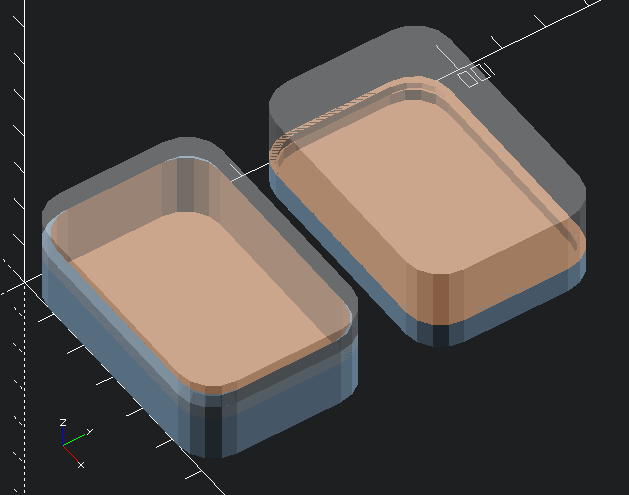
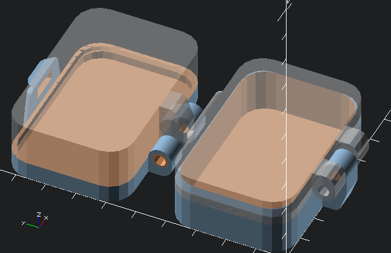
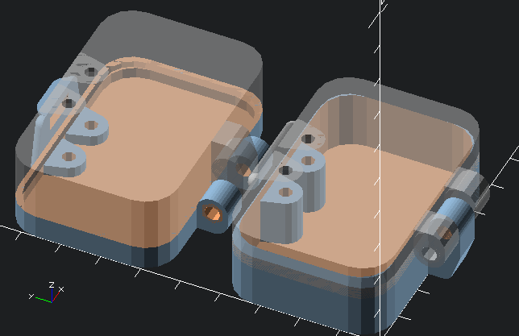
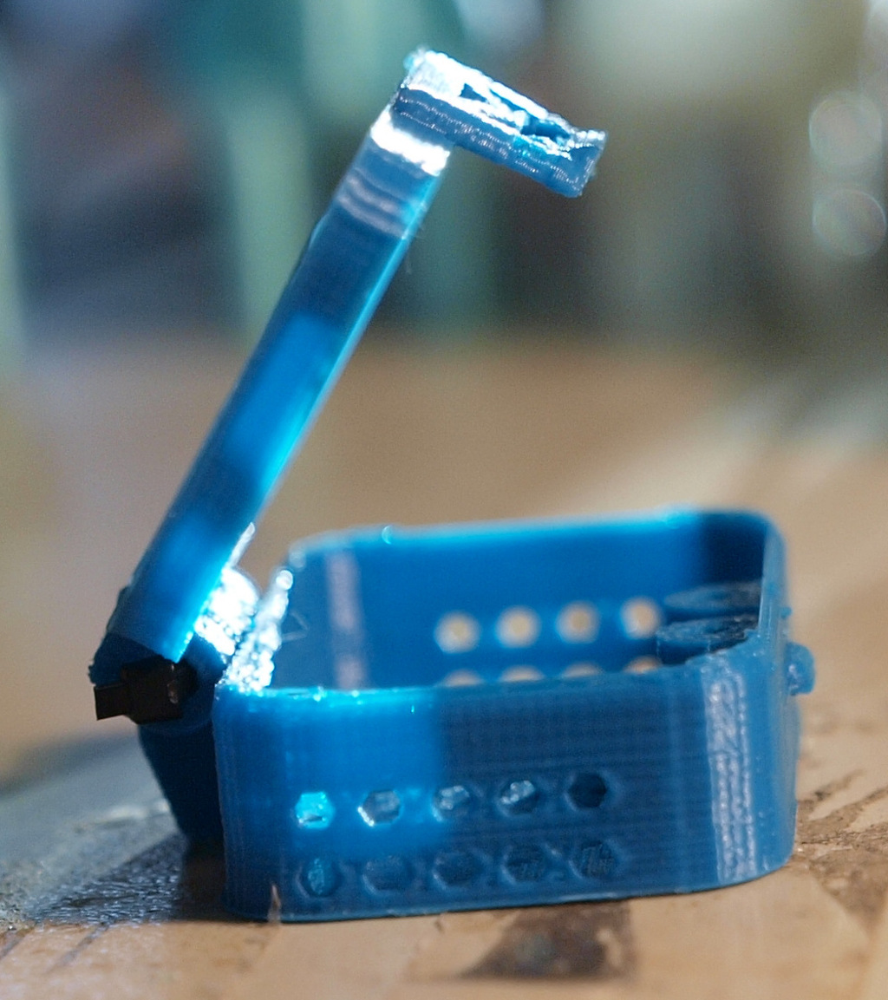

# Mark's Enclosure Helper
## Let's Build a Bee Box

  https://github.com/h2odragon/MarksEnclosureHelper

Copyright (c) 2019 Mark and Marie Lamb. Distributed under GPLv3, see LICENSE for terms.

 - [Basic Box](#basic-box)
 - [Hinges](#hinges)
 - [Catch Clasps](#catch-clasps)
 - [Screw Towers](#screw-towers)
 - [Cutouts](#cutouts)

If you've never used OpenSCAD before, we suggest you spend some time
reading the [official
documentation](http://www.openscad.org/documentation.html) and
tutorials available at the OpenSCAD web site and eslewhere. This
tutorial is aimed to help you create a box without any OpenSCAD
experience, but we encourage learning how to use this truly excellent
tool.

You should have downloaded and installed OpenSCAD already. (We're using
version **2015.03**, the current release as of this writing.) When was
say "create your own SCAD file"; this file can be located wherever
you like. For now is probably best located in the same directory
you've unpacked the Mark's Enclosure Helper package into; the
`hingebox_code.scad` file will need to be in the same directory as
your code.

Following along with this tutorial creates your own version of the
`example-beebox.scad` file. You might name it `my-beebox.scad` if you
like. Either place it in the same directory as the
`hingebox_code.scad` file, or copy that file to your working directory
(preferable for more complicated projects, later).

--------
## Basic Box

Begin your box by creating a new OpenSCAD file. Put these two lines
near the top:
```
include <hingebox_code.scad>
hingedbox( box_def );
```
This includes all of the `hingebox_code.scad` file into yours, and
invokes the `hingedbox` module in it to create the box.

>_(Because the `hingebox_code.scad` file is several hundred lines, the
>console window on your OpenSCAD will report line numbers in error
>messages that don't match those in your editor window.)_

When you preview this, you should see the generic default box.


>_"What's the grey stuff?" That's the other half of the box, visualized
>in its eventual place, as a ghost image. If you dont want this it can
>be turned off at any time by putting `VIS=false;` in
>your script._

>Under the OpenSCAD Design menu, we suggest the "Automatic Reload and
>Preview" option be **on**. This updates the view of the object every
>time you save (which can be done with CTRL-S). We suggest you do this
>very, very often. Train your fingers to use
>CTRL-S to update the preview instead of F4 or F5; and you may be glad
>of it later. 


After the line, `hingedbox( box_def );`, start adding definitions to
make this box fit your purpose. These go after the `include` line, to
ensure they are the last definitions of these values. OpenSCAD only
listens to the last thing it heard.

The first thing to set will be the size:
```
include <hingebox_code.scad>
hingedbox( box_def );

box_def = [60,40,20];
```

This defines our completed, closed box dimensions as 60mm wide (X
dimension), 40mm deep (Y dimension), and 20mm tall. The are the
**OUTSIDE** dimensions, the inside will be this minus two walls.

Now we set some of the other variables:
```
include <hingebox_code.scad>
hingedbox( box_def );

box_def = [60,40,20];
wall_thick = 1.2;

top_rat = 0.20;
lip_rat = 0.10;
```

`wall_thick` is the thickness of the walls, which includes outside
walls of the box and is used for other structures as may be needed.

`top_rat` and `lip_rat` define the height (Z) of the top/bottom split,
and the height of the overlapping lip. These numbers are multipliers
applied to `box_def.z`, so in our example will result in a box top
of `box_def.z` * `0.2` = 4mm and therefore a bottom of 16mm. The 2mm
of lip will appear on both halves of the box, it overlaps when the box
is closed.

Your preview window should now look similar to this:




-----------
## Hinges

Next let's put a hinge on it. This is a small box and a single hinge
should be fine. We specify its size and placement:
```
hinge_points = [0.5];
hinge_len = 24;
```

`hinge_points` is a list of points to place hinges. In this case
there's just one item. Each point in that list is a multiplier applied
to `box_def.x`; this example results in one hinge at the middle of the
back of the box. Two hinges at 25% and 75% of the box width could be
specified as: `hinge_points = [0.25, 0.75];`.

`hinge_len` specifies that the hinge, overall, should be 24mm
wide. The ratio of the top and bottom portions of the hinge and other
features can also be varied, see the reference for
[`hinge_xrat`](REFERENCE.md#hinge_xrat) when you wish to do that.


----------
## Catch Clasps

To keep the box closed when we want it closed, let's put a catch clasp
on, by adding:
```
catch_points = [0.5];
```
to our file. The catch clasp is a tab on the front of the box top that
slides over and catches a tooth on the box bottom. Specifying `0.5`
means we want a single clasp, centered at half of the box width
(`box_def.x`).

You can modify the placement, thickness, and proportions of the clasps
in several ways, see the [catch clasps](REFERENCE.md#catch-clasps)
reference for details. For now, we'll stick with the defaults.

Your file should look like this:
``` 
include <hingebox_code.scad> 
 
hingedbox( box_def ); 

box_def = [60, 40, 20]; 
wall_thick = 1.2;  

top_rat = 0.20;  
lip_rat= 0.10;  

hinge_points = [0.5];
hinge_len = 24; 

catch_points=[0.5];
```
And your preview window like this:



This is a complete and functional box as is, but for this example we
have a few more things to do. This catch clasp is a reasonable closure
but we may want a more secure box, if we're say mailing insects
around.

--------------
## Screw Towers

A screw tower is a reinforced column in the top and bottom inside of
the box, with a hole through it for a screw. Specify a pair thus:
```
screw_points = [0.4, 0.6];
```

In this case we want the bottom of the box to be punctured, and the
hole to go all the way through, so we could use a ziptie to secure the
box closed. So we'll add:

```
screw_punchbottom = true;
```

Resulting in a box that looks like:



See the [screwtower reference](REFERENCE.md#screw-towers) for all the
options available to change the shape and behavoir of this part. For
the moment the most important variables to you are probably [`screw_od`](REFERENCE.md#screw_od)
and [`screw_bspread`](REFERENCE.md#screw_bspread) which control the
diameter and wall brace size of the screw tower. We'll stick with the
defaults for now.


-------------
### Cutouts

Our box is a complete thing now; but lacks an essential detail. To be a
fit temporary home for living things, it will need ventilation. We've
provided some utilities that make that easy.

We'll use the [`cyl_grid()`](REFERENCE.md#cyl_grid) module to generate
a pattern of cylinders, which we will then remove from the wall of our
box. Define a module thus:
```
module myperf(d) {
    cyl_grid(d, 0.60, 3, 4.8, 6 );
} 
```

`d` will be provided when the module is called, as a `[x,y,z]` box
definition. We can use our `box_def` for testing.

This creates a grid of cylinders of 3mm diameter, with 4.8mm spacing,
with 6 facets on the cylinders. The grid is sized and centered in 60%
of the box defined by `d`. Where that division comes out uneven it
will produce a short grid, which is acceptable for our purpose here.

At top of your script, comment out the `hingebox` invocation, and add
a call to your module to test it.

> _"Comment out" in this case means add two slashes to the beginning of
> the line, in case that term is unfamiliar._

Your script should look like this:
```
include <hingebox_code.scad> 
 
//hingedbox( box_def );   //  <-- NOTE COMMENTED
myperf( box_def);

box_def = [60, 40, 20]; 
wall_thick = 1.2;  

top_rat = 0.20;  
lip_rat= 0.10;  

hinge_points = [0.5];
hinge_len = 24; 

catch_points=[0.5];

screw_points = [0.4, 0.6];
screw_punchbottom = true;

module myperf(d) {
    cyl_grid(d, 0.60, 3, 4.8, 6 );
} 
```
and should produce a preview like this:


>Commenting out the `hingedbox` line leaves our `myperf` module the
>only thing being created and shown, which makes things much easier
>when debugging a creation. The actual location of those lines ins't
>terribly important, they can be at the end of the file or even
>somewhere in the middle if you like; but we find it more clear to do
>things this way. The first thing you see when you look at the script
>is what it's doing.

Now we apply our pattern to the faces we want to perforate by adding
the following lines to our script (at the bottom, after the closing
brace of the `myperf` definition):

```
module cutout_top( d ) { myperf(d); }
module cutout_bottom( d ) { myperf(d); }
module cutout_left( d ) { myperf(d); }
module cutout_right( d ) { myperf(d); }
```

Un-comment `hingebox` invocation (and comment out your `myperf`
invocation). As the box is built the `cutout_top`, bottom, left
and right modules get called with `d` defined for each face, which
results in our cylinder pattern being created for each face's size,
then subtracted from that face. See the reference for
[callbacks](REFERENCE.md#callbacks) for everything you can do here.


The whole script should look similar to this:
```
include <hingebox_code.scad>

hingedbox( box_def );
//myperf( box_def );      // <--NOTE

box_def = [60, 40, 20]; 
wall_thick = 1.2;  

top_rat = 0.20;  
lip_rat= 0.10;  

hinge_points = [0.5];
hinge_len = 24; 

catch_points=[0.5];

screw_points = [0.4, 0.6];
screw_punchbottom = true;

module myperf(d) {
    cyl_grid(d, 0.60, 3, 4.8, 6 );
} 

module cutout_top( d ) { myperf(d); }
module cutout_bottom( d ) { myperf(d); }
module cutout_left( d ) { myperf(d); }
module cutout_right( d ) { myperf(d); }

```

Producing an object like:


Congratulations! You can now render your box (using **F6**), export it
as an STL file, take that into your slicer and print away.

These should be very easy to print, we've had success with and without
supports, with and without a print cooling fan, and with several
nozzle sizes. We've even had succesful boxes that functioned despite
layer shifts and other common printing errors.

Assembling the box is pretty straightforward; we have illustrated a
technique for installing [ziptie hinge
pins](REFERENCE.md#box-assembly) or you should be able to use an M3
screw and nut as a hinge pin. Other options are limited only by the
imagination. :)

When finished, this box looks like this:





This is not all Mark's Enclosure Helper can do; see the other examples
for more possibilities.

If you find this project useful, **[PLEASE DONATE](https://www.paypal.com/cgi-bin/webscr?cmd=_s-xclick&hosted_button_id=J3AY8SM43A2DA&source=url)**, thanks! 


