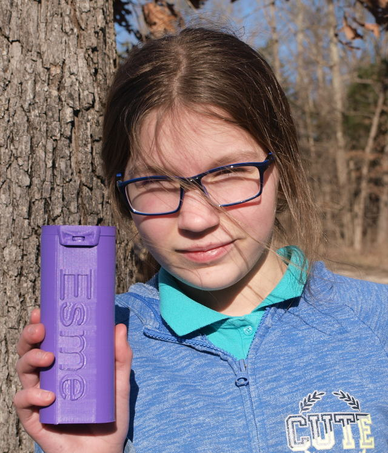
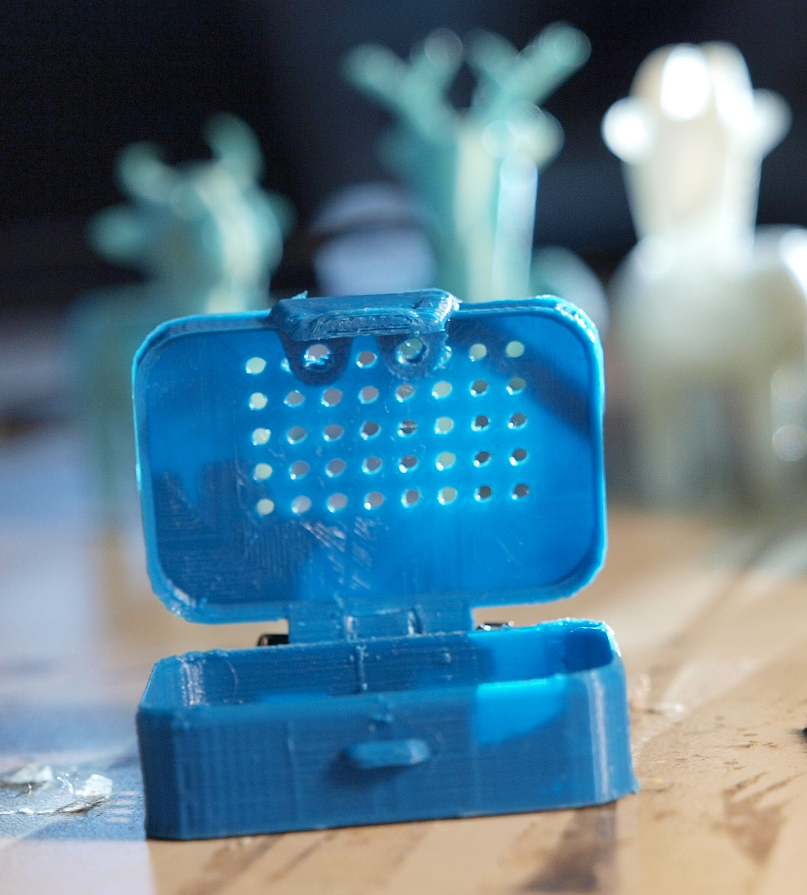
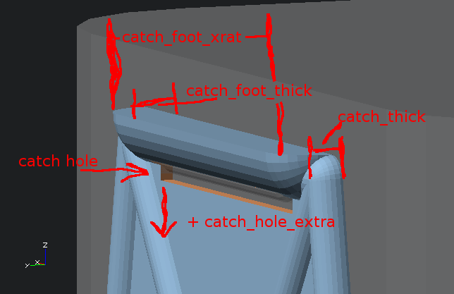
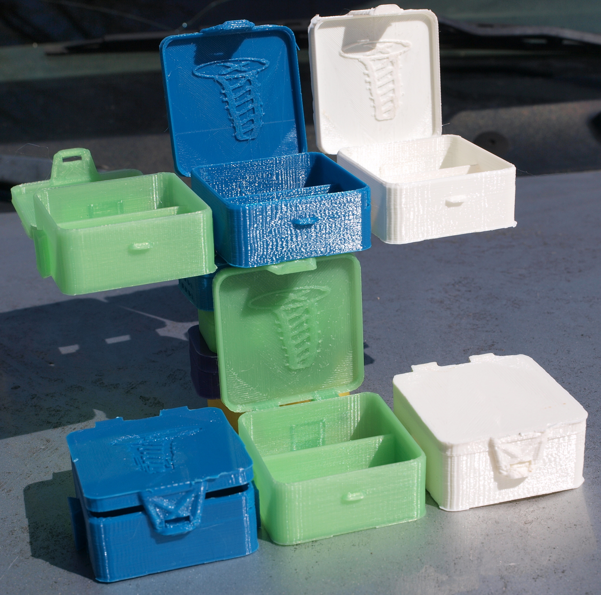
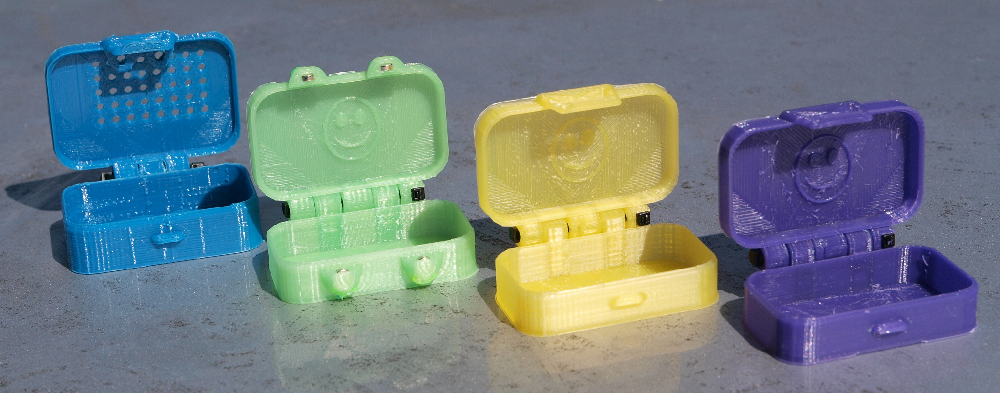
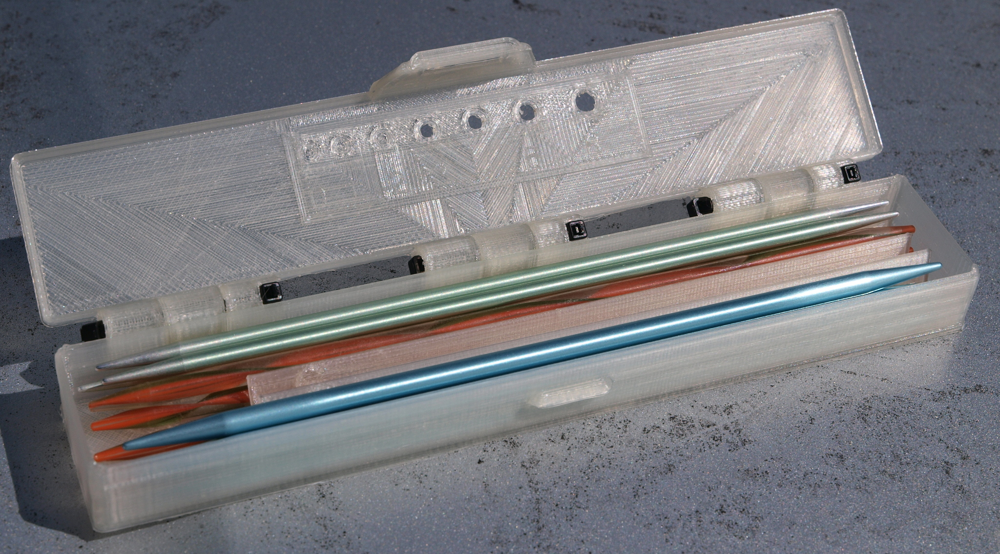
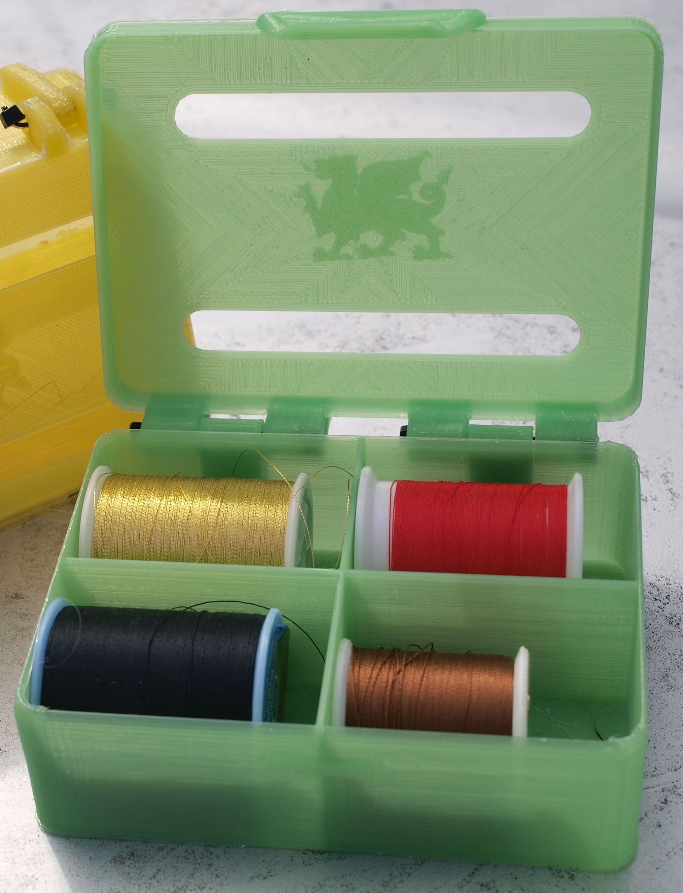
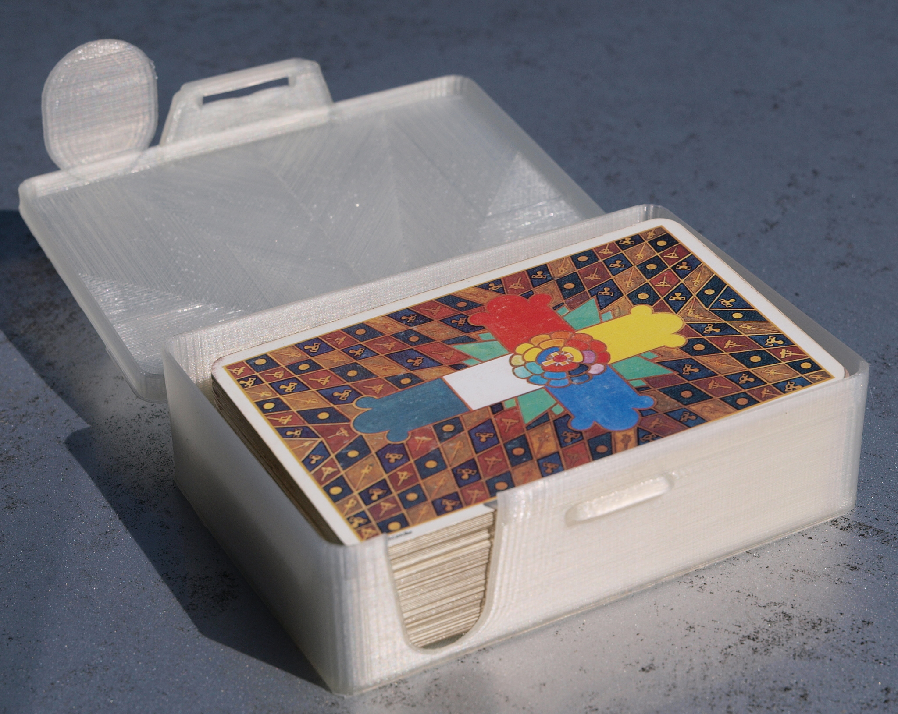
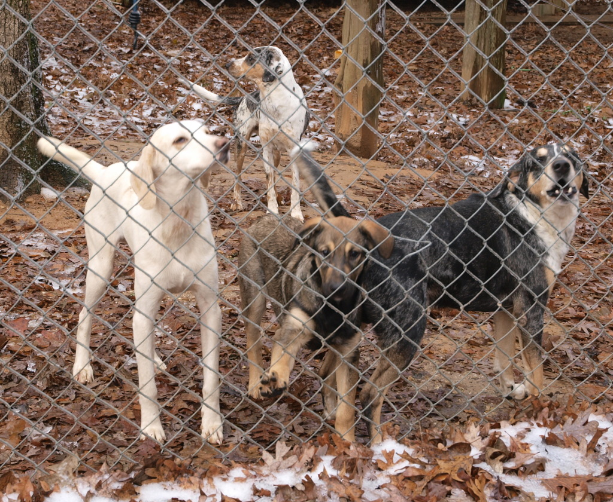
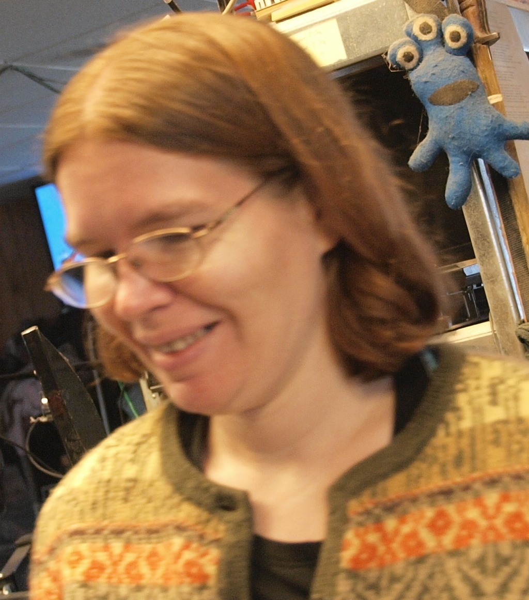

# Mark's Enclosure Helper 

This is an OpenSCAD script for generating a two peice hinged box, with
rounded corners, lid, interlocking rims, snap fit, magnet, or screw
closures, and easy places for adding cutouts or additions to any
face. All features are optional and specified by defining a few simple
variables. Included utility functions make perforations, text and
image decorations possible in a single line of code.

Additional parts inculding dovetails and belt clips are also included.

-----------------

We've tried to make this useable for those less comfortable with or even
new to OpenSCAD. See the "Let's Build a Bee Box" tutorial: 

[LETSBUILD-beebox.md](LETSBUILD-beebox.md).

-----------------

Experienced OpenSCAD users may wish to skip straight to the docs:

[REFERENCE.md](REFERENCE.md) 

or to hacking at the included examples:

-----------------

[Eyeglass Belt Case](example-eyeglass-beltcase/)

-----------------

[Interlocking Parts Boxes](example-partbox/)

-----------------

[Mini Mint Tin with Magnet or Catch Clasp](example-minitin/)

-----------------

[Neddle Keeper with Sizing Guage](example-needlekeeper/)

-----------------

[4 Spool Thread Keeper](example-threadkeeper/)

-----------------

[Card Deck Case](example-cardcase/)

------------------------------

We hope you find this code useful, and ask that you **[hit this donate
link](https://www.paypal.com/cgi-bin/webscr?cmd=_s-xclick&hosted_button_id=J3AY8SM43A2DA&source=url)**
please.

We've got a large collection of mouths to feed and your generous
donations may help me convince my lovely, loving, and patient wife
that losing me to a coding project for the last month was
worthwhile. 

My inspriration :)

-------------------------------
   Copyright (c) 2019 Mark and Marie Lamb. Distributed under GPLv3, see LICENSE file for terms.

