# Mark's Enclosure Helper - Reference

  https://github.com/h2odragon/MarksEnclosureHelper
 
Copyright (c) 2019 Mark and Marie Lamb. Distributed under GPLv3, see
LICENSE file for terms.

- [Features](#features)
- [Usage](#usage)
- [Box Assembly](#box-assembly)
  - [Magnet Insertion](#magnet-insertion)
- [Main Modules](#main-modules)
  - [Layout Variables](#layout-variables)
- [Box](#box)
- [Hinges](#hinges)
- [Catch Clasps](#catch-clasps)
- [Magwarts](#magwarts)
- [Screw Towers](#screw-towers)
- [Callbacks](#callbacks)
- [Parts](#shapes)
  - [Dovetails](#dovetails)
  - [Wartclip](#wartclip)
- [Utilities](#utilities)
  - [diecut()](#diecut)
  - [center_scale()](#center_scale)
  - [slots()](#slots-yslots-and-grid)
  - [yslots()](#slots-yslots-and-grid)
  - [grid()](#slots-yslots-and-grid)
  - [cyl_grid()](#cyl_grid)
  - [dividers()](#dividers)
  - [cylinder_half()](#cylinder_half-capsule-capsule_qtr)
  - [capsule()](#cylinder_half-capsule-capsule_qtr)
  - [capsule_qtr()](#cylinder_half-capsule-capsule_qtr)
  
-----------------------------------------------------
## General Overview

>
>"Meh. It's a box."
>

We wanted to make it easier to make custom enclosures using
OpenSCAD. When you want a box, you want it for a purpose and you want
the features like the custom insert to hold **your** thing, or the
name of the recipient for a gift box embossed on it.

We certainly did. It turns out that even with the plethora of designs
shared already, few of them were adaptable to the list of enclosures
we already wanted to make, and none easily. We'll grant you we
could've spent more time looking.

Our hope is that this package fills that void. If you need a box with
a hinged lid, snap fit or magnetic catches, optional rim and rounding,
then this can be the box for you, and you can spend your time and
ingenuity on the "everything else" that makes it yours, while our code
does the boring box things for you.

If you find this project useful, **[PLEASE DONATE](https://www.paypal.com/cgi-bin/webscr?cmd=_s-xclick&hosted_button_id=J3AY8SM43A2DA&source=url)**, thanks! 


-----------------------------------------------------
## Features

* Rounded rectangular box, with top and bottom. You specify size and
   where the top and bottom are split. Shape can be distorted to
   nearly circular.

* Extensive, illustrated reference documentation.

* Beginner freindly tutorials. (Well, [one so
  far](LETSBUILD-beebox.md) but we intend to add more.)

* Several simple and more advanced examples provided.

* Parametric design: You provide the important definitions of size,
  and placement of features such as hinges and closures, and the code
  makes everything fit together.

* Optional overlapping rim between top and bottom.

* Hinges of any number and size along the back of the box. Hinges can
  be shaped and sized as your purpose requires and the hinge pin
  hardware you supply dictates.

* Set the hinge rotation axis anywhere, the design adjusts.

* Multiple closure options: Snap together catch clasps, magnet
  holders, or reinforced tie points. Or make your own and apply them
  to the box with two lines of code.

* Internal dividers can be created with one line of code; your own
  custom insert structures can be applied as easily.

* Fully control the sizes and shapes of many features, but with
  reasonable default values that should "just work" in most cases,
  tested on a variety of equipment.
  
* Easily perforate / decorate / complicate whichever face of the top
  or bottom of the box you please. You're free to work on getting your
  decorations as you like them, while our code takes care of the fiddly
  positioning and orientation for you.

* Interlocking dovetail shapes provided for grouping boxes together. 

* Easy to print: We've had success printing with and without supports,
  using several printers and nozzle sizes. We've even had some
  functional if ugly examples that suffered layer shifts, alignment
  errors, and other common printing issues.

-----------------------------------------------------
## Usage

`include <hingebox_code.scad>` in your own OpenSCAD script, define
whichever variables you need, and call `hingedbox( box_def )`.

If that didn't make any sense please see the
[beebox](LETSBUILD-beebox.md) tutorial.

A simple box script might look like this:
```
include <hingebox_code.scad>

hingedbox( box_def );

box_def = [60, 35, 20]; 
wall_thick = 1.2;  
top_rat = 0.35;  
lip_rat= 0.05;  

hinge_points = [0.5];
hinge_len = 22; 

catch_points=[0.5];
```
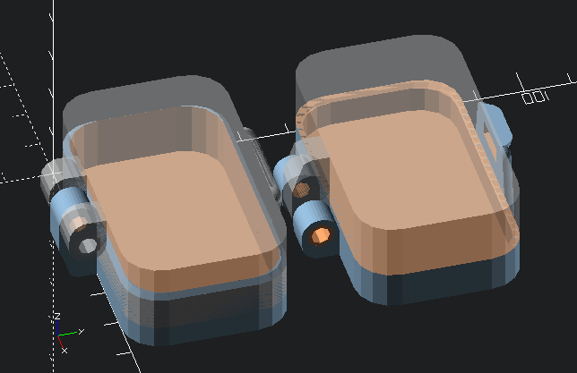


### Licensing and Remixing

We're distrubiting this code under the GPLv3. That's a well known
license but we're not certain of the implications for 3d printing
work. We'll make our intent clear as possible:

YOU MAY use `hingebox_code.scad` as part of your OpenSCAD script to
generate a model (STL file, etc) that you then distribute,
commercially or otherwise, without any obligation from us to publish
your code. We would appreciate mention and a link to our GitHub page
in that case, but you are not obliged.

If you distribute your `.scad` file as well; you need not include
`hingebox_code.scad` with your package, and should instead point users
to the GitHub page with a link so they may access the latest revisions
if any. We do not assert any rights over how you may license such a
release. We do require attribution, a simple "uses
github.com/h2odragon/MarksEnclosureHelper" will satisfy us. 

If you change OUR CODE, the `hingebox_code.scad` file, the example
boxes, and distribute that, then you MUST also publish your changes to
our code as part of that distribution. We thank you for contributing
to Free Software. We would prefer potential new users be introduced to
the whole distribution, including documentation, so please include the
whole archive you got when copying on.

If you need different license terms, please get in touch.

### Disclaimer

Any and all personal and organizational use of our code that do not
involve distribution of actual bits we generated, are not our
responsibility and have nothing to do with us. We do not warrant this
code to be free from defects, suitable to any purpose, able to make
delicious candies, or to be of any utility at all. In the event of
unexpected performance or interfeference with performance of any other
information or belief system we can offer no remedy.

-----------------------------------------------------
## Box Assembly

Assembling the box is straightforward, peel any brim and support
material, and place the box top on the bottom. Everything should fit
together smoothly.

If you're using a screw and nut for the hinge pin, put them in now,
and you're done. That's a durable and easy solution which we have used
on several boxes. It could get expensive quickly if you don't stock
large amounts of hardware, however. And it's often hard to find a long
enough screw, so you may have to resort to plastic substitutes.

We've been using 4 inch zip ties for hinge pins while printing
prototype boxes, and developed a technique we think
worth sharing. You'll need two ties to make a hinge pin. We're
illustrating using a box with [hinge ziptie notches](#hinge_ztnotch)
but it works as well with the ties protruding.

Insert the first tie through the hinge, so that the tie's block (the
fat bit at the end) could slide into the notch.
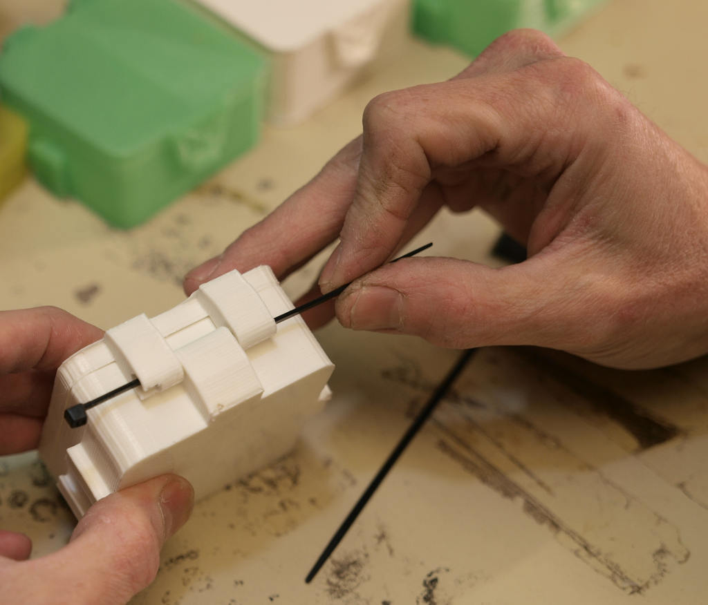

The second tie slides onto the first, yin-yang style:
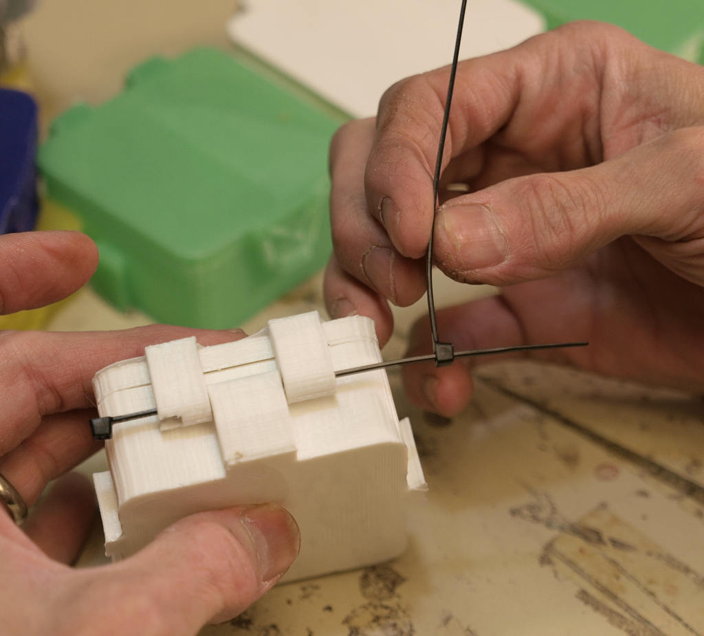

The free end of the second tie goes through the hinge hole:
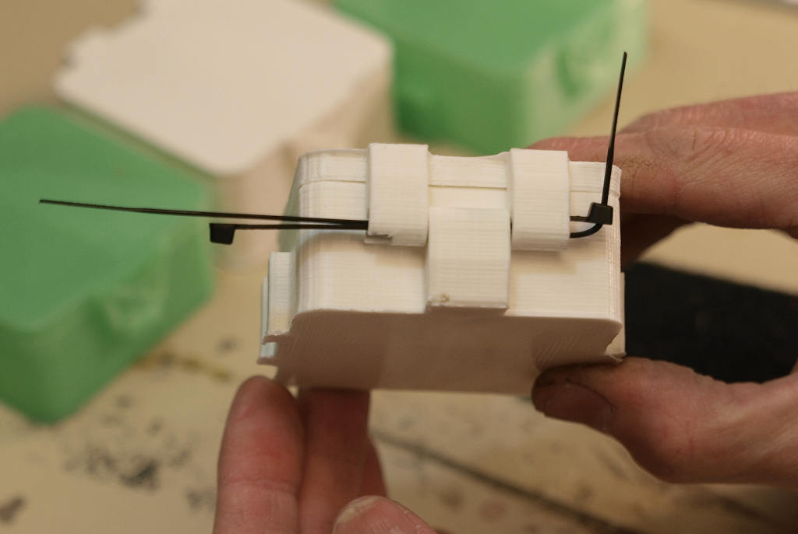

And then through the block of the first tie.
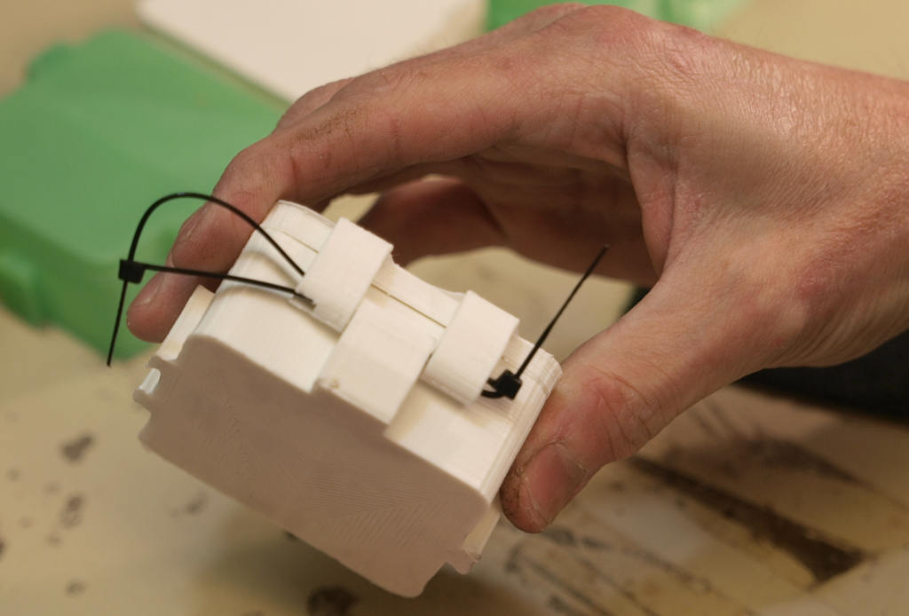

You will probably want pliers to pull the ties tight.
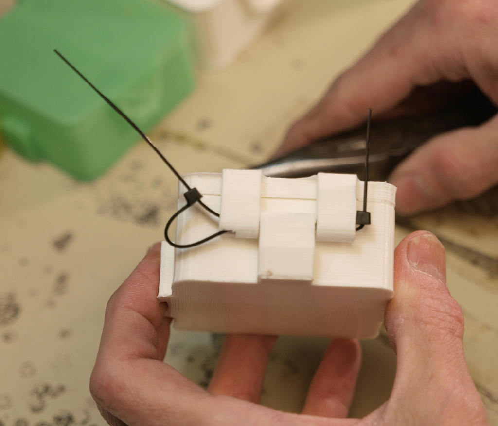

Titghten one tie almost all the way down, then pull the other tie
fully titght.
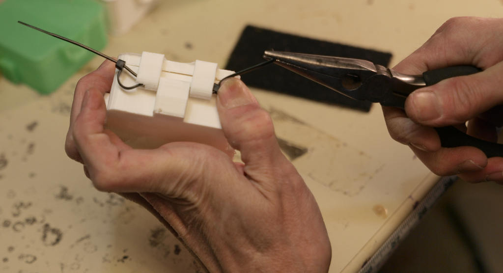

Snug up the first tie
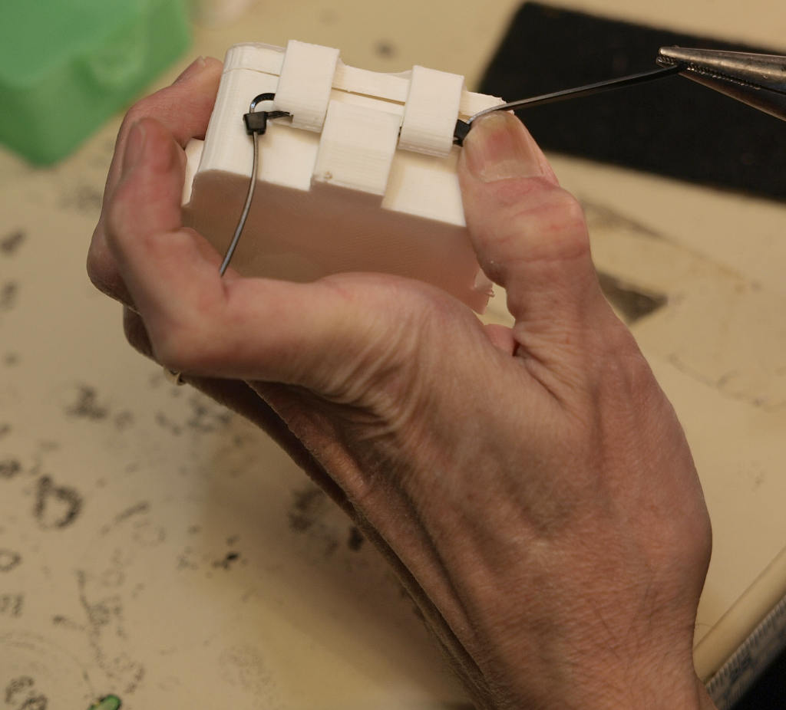

As you pull the ties in, make sure they line up with the notches
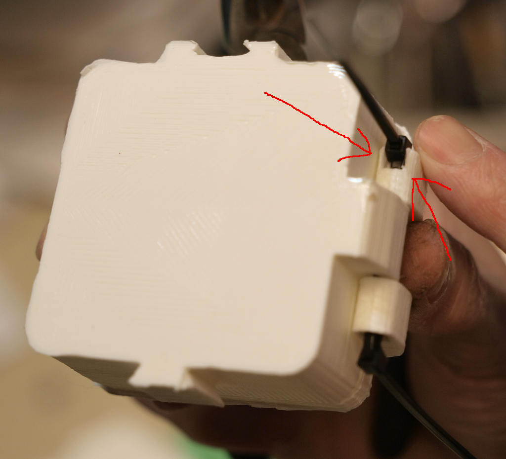

When using notches the ties can, with care, be completely
hidden. Keeping them out of the way is often good enough.
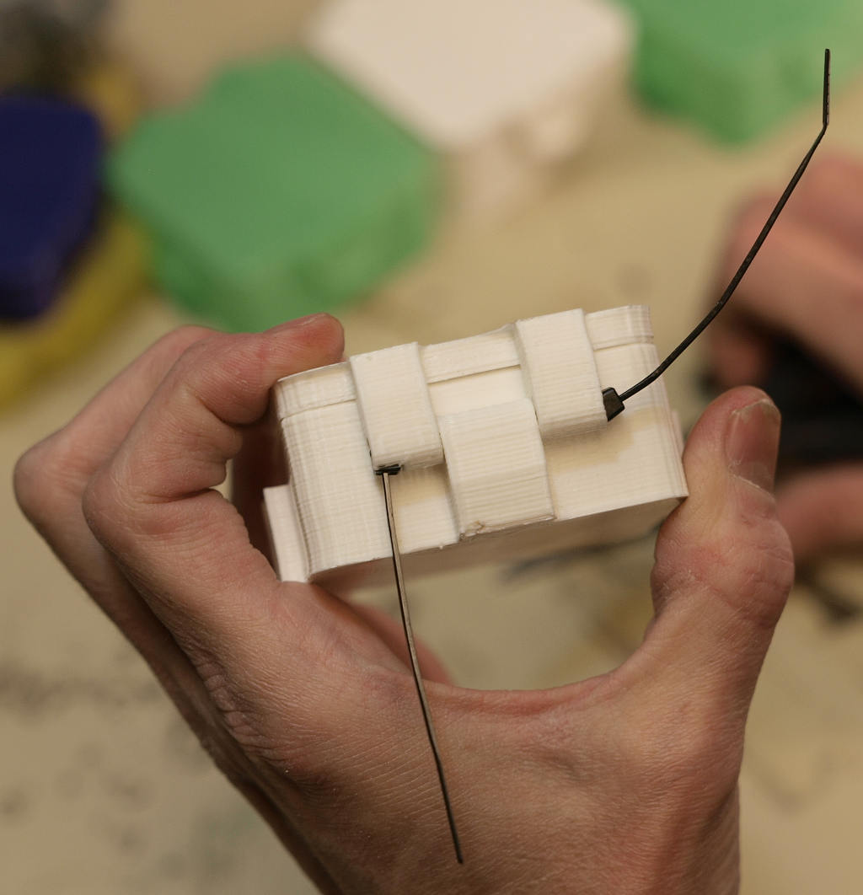

Cut the excess material off (very close to the block, the one side
will rub the box as the lid opens if there's much leftover).
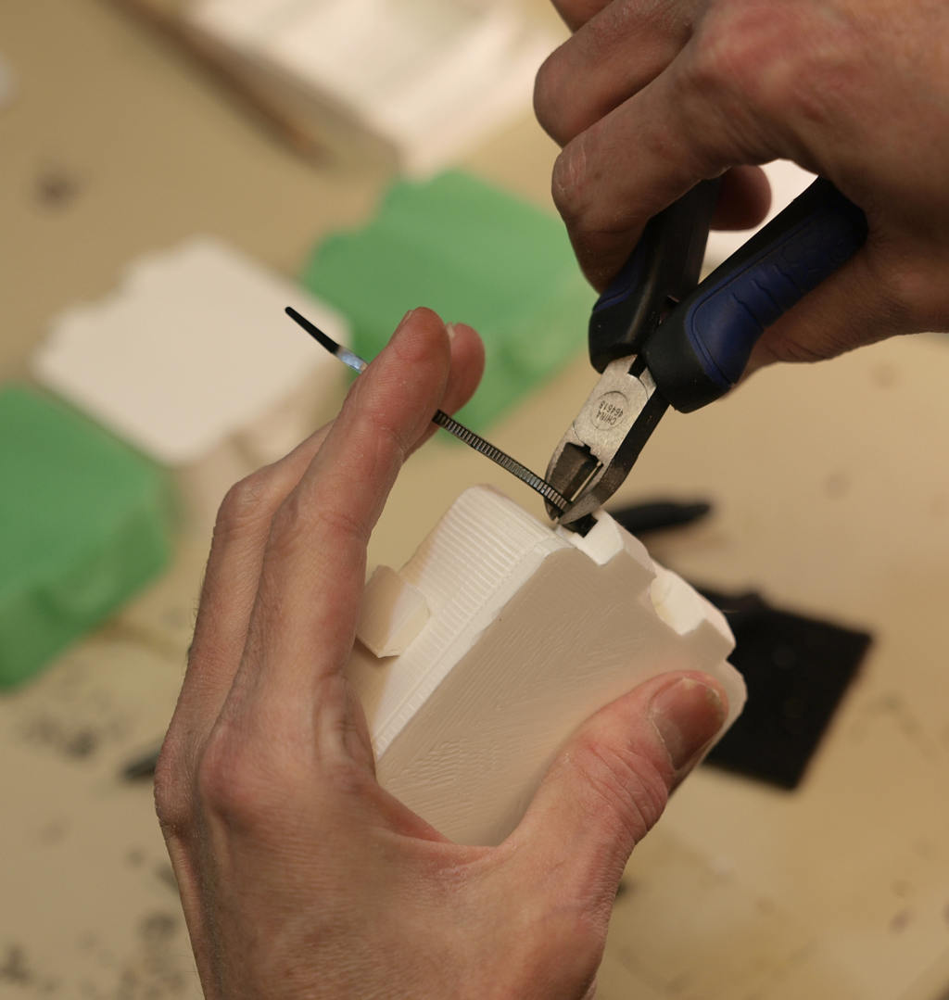

Your hinge now has an effective **cheap** pin that should last as long
 as the rest of the box.
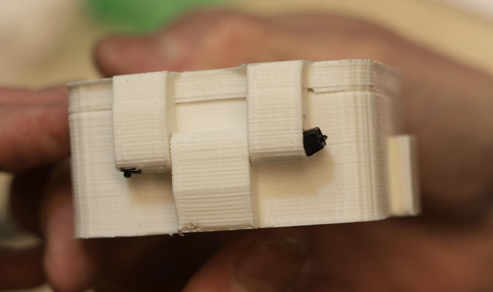
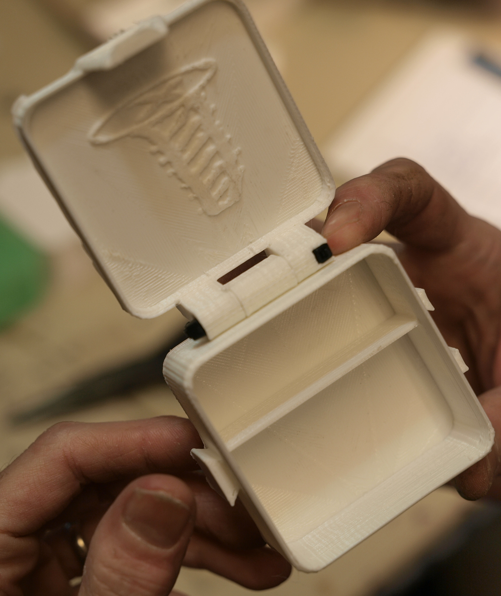

-----------------------------------------------------
### Magnet Insertion

Slide one magnet into either the top or bottom magwart. Use that to
determine the correct orientation for the second magnet, so that they
attract one another instead of pushing each other apart. Slide the
second magnet into the other magwart, being sure to keep the magnet
oriented properly. Getting one back out can be frustrating.

You should do something to ensure the magnets can't fall out of the
magwart body. We've used superglue, hot glue, and hot plastic blobbed
on with a "3d Pen" extruder; all worked well. The plastic looks best,
we think. Gluing in a bit of filament might work too.


-----------------------------------------------------
## Main Modules

### hingedbox
=======================
```
module hingedbox( d ) {}

- Creates the box top and bottom, laid out beside one another, with
  the other half of each optionally shown in place as a ghost. 
```

Uses `VIS` flag to show ghost assemblies and `PART_SPACE` to add
distance between parts.


### hingedbox_half
=======================
```
hingedbox_half( d, topflag=false) {}

- Build top or bottom half of box `d` based on boolean `topflag`
```

The actual meat of the code happens here. 

### Layout Variables
=======================
```
// show ghosts, top/bottom and magnets
VIS=true;  

// extra space between top and bottom for printing
PART_SPACE= 2; 
```
=======================


-----------------------------------------------------
## Box

These variables define the dimensions and shape of the box, where the
top and bottom split, and the size of the overlapping rim between the
two.

`CLEAR` is a global parameter applied wherever parts meet.

=======================
```
// width (x), depth (y), height (z)
box_def = [60, 30, 30]; 

// wall thickness (all around)
wall_thick = 2;  

// how much height (z) is top (rest is bottom)
top_rat = 0.15;  

// height (z) of lid lip overlap chamfer (0 to disable). 
//  (should be less than top_rat)
lip_rat= 0;  

// box corner radius
corner_radius = 8;  

// box corner $fn
corner_fn = 16;     

//nut inset dia and nut inset thick (depth)  
// used in hinge and screw tower, disable by setting hnut_t = 0
hnut_d = 6; hnut_t = 0; 

// space between hinge parts, top/bottom screw towers
CLEAR=0.6;  
```

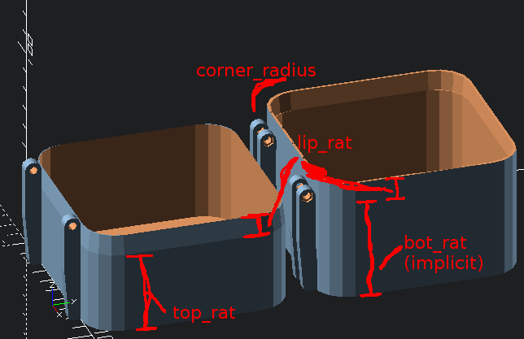

### box_def

[X, Y, Z] specification defining the outside of the box body. The
inside is reduced by `wall_thick`. Hinges, claps and other features
will protrude outside the box body.

### wall_thick

Thickness of walls. Used in the box body and several other places.

### top_rat

Factor applied to `box_def.z` to determine the box lid height. If
`lip_rat` is nonzero, there will also be a hollowed out rim around the
lid which will overlap the bottom when assembled.

### lip_rat

Factor applied to `box_def.z`, determines height of overlapping lip on
the top and bottom box parts.

### corner_radius

Radius of the cylinders making up box corners. Will produce strange
results when greater than half of `box_def.y`


### corner_fn

$fn of box corner cylinders.


### CLEAR

General 'clearance' value used in many places. Primarily between top
and bottom hinge parts, but also used most anywhere else parts fit
together. We've had success with the default value of 0.6mm on
printers using 0.4mm, 0.5mm, and 0.6mm nozzles.

### hnut_d, hnut_t

Diameter and thickness of hexagonal nut incised from outer hinge faces
and scretower holes. Set `hnut_t = 0` to disable.


-----------------------------------------------------
## Hinges

The hinges join the top part to the bottom and rotate around a hinge
pin you supply. We've designed around and used M3 size screws and
paired 4 inch zipties as hinge pins. Zipties are cheap, durable,
and easy to assemble, so we reccomend them fondly.

=======================
```
// height of hinge axis; % of total height (aka dz or box_def[2] )
hinge_zrat = 0.70; 

// points along width (x)  to place hinges, leave empty for none
hinge_points = [ ];  
  
// length of single hinge; splits top/bottom by hinge_xrat
// anything under 10 is probably too delicate to use
hinge_len = 16; 

// how much hinge_len is bottom tower. (>1 taken as a concrete unit)
//   ( the hinge top splits the rest in half, on the outside of the lower hinge)
hinge_xrat = 0.33; 

// if you want to separate the hinge towers from the box body
hinge_standoff = 0; 

// where the hinge leg bends (z), % of hinge height
hinge_midpoint = 0.5; 

// where the hinge leg ends. <1 * lz, >1 taken absolute.
hinge_basepoint_bottom = 0;
hinge_basepoint_top = 0;

// diameter of hinge root cylinder
hinge_root_d = false; // hinge_id;

// the diameter of the outer hinge cylinder
hinge_od = 8; 

// hinge_id of 3.8 to 4.0 works for m3 screw and 4in ziptie
hinge_id = 4.0;  

// size of hole to put through hinge_midpoint; 0 to disble
hinge_mid_hole = 0;

// outer $fn for hinge, and inner $fn for hinge pin hole
// keep outer high; hinges rub the other half of the box without standoff
hinge_ofn = 36;
hinge_ifn = 8;

// Zip tie notches
// if nonzero, take a cubical notch this size from the top hinge outside faces
hinge_ztnotch = 0;
```

### hinge_points

List of points to place hinges. Specified as factors applied to
`box_def.x` which define the center point of the hinge assembly.

### hinge_zrat

Defines the point at which the hinge pin should lie, relative to the Z
dimenzion of the box definition (`box_def.z`). This point changes how
the box lid sweeps in over the top as it closes, some combinations of
configurations won't work.


**hinge_zrat** | result (`hinge_standoff` used for illustration)
---------------|-------
`hinge_zrat = 0.1` | 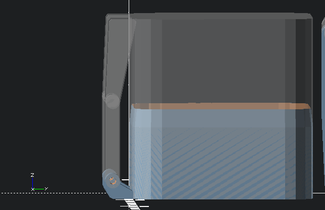
`hinge_zrat = 0.8`  | 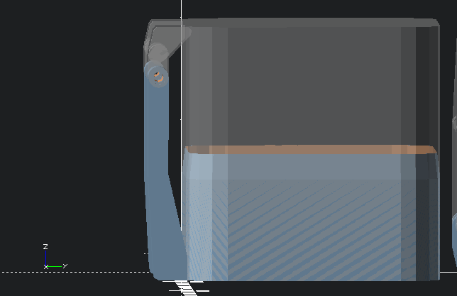


### hinge_len

Length of a whole hinge, that is the top and bottom taken together.


### hinge_xrat

Ratio by which the hinge is split into the bottom, single part and
thus the top two parts. The bottom part of a hinge is `hinge_len *
hinge_xrat`; the top parts split whatever length remains (less the
value of CLEAR, see elsewhere).

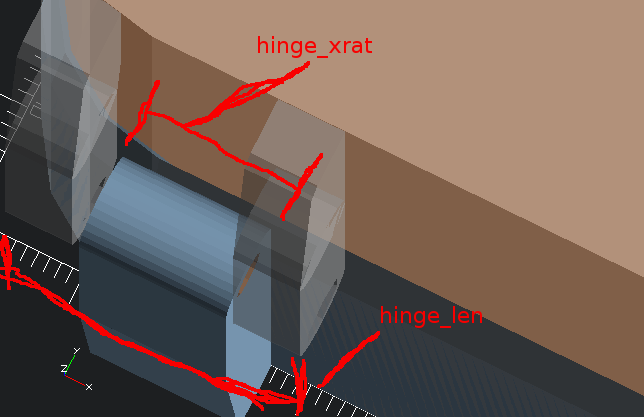

### hinge_basepoint_top
### hinge_basepoint_bottom

Controls the bottom of the hinge leg, for the box top and bottom parts
respectively. May be specified absolute (>1) or relative to the part
height (<1). Default 0; which extends the hinge the full box height.

### hinge_root_d

Diameter of cylinder making up the base of the hinge leg. Defaults to
`hinge_id`; increase to make the hinge root larger and more solid.


### hinge_od

The outer diameter of the hinge body cylinder. This dimension governs
the overall Y protrusion of the hinge from the box body.

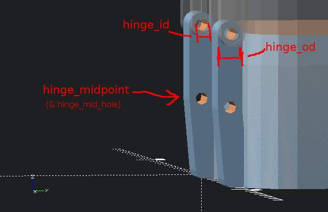

### hinge_id

The inner diameter of the hole cut for a hinge pin.

### hinge_midpoint

The point at which the hinge begins to shrink into the box body. Is
another cylinder of `hinge_od` diameter and can overlap the hinge
pin. Specified as a factor which is applied to the Z dimension of the
hinge parts, which will lead to different results with different
combinations of other hinge parameters.

### hinge_ztnotch

If nonzero, dimensions a cube taken from the outer faces of the top
hinge parts. Intended for tucking away ziptie ends. Our 4 inch zipties
have 4mm clip ends and fit well in a 4.4mm notch.

### hinge_ofn, hinge_ifn

The `$fn` for the outer and inner hinge cylinders, respectively. Keep
the outer $fn high to ensure parts can rotate freely when in contact,
or use `hinge_standoff` to provide extra clearance if necessary.

### hinge_standoff

Specifies distance to offset hinge in the Y dimension. Offsets the
portion of the hinge body from the cylinder surrounding the hinge pin
to `hinge_midpoint` away from the box body in the Y dimension.


### hinge_mid_hole

If nonzero, another hole will be cut from the hinge midpoint. This
might be used for retaining a single ziptie hinge pin, for example.


-----------------------------------------------------
## Catch Clasps

Catch clasps provide a positive action snap fit closure. A clasp tab
on the box top, which extends past and overlaps the box bottom when
closed. A matching catch tooth on the box bottom fits into a hole in
the clasp providing the retention. A catch foot protrudes from the
bottom of the clasp to provide grip and leverage for bending the clasp
past the tooth to open the box.

**PRINTING NOTE** The catch clasps rely on tight tolerance and sharp
  corners on one side and a smoothly rounded shape on the
  other. Depending on your equipment and materials you may be able to
  print them without supports, we've had success doing so. Larger
  openings and longer bridged areas will benefit from supports but may
  be delicate and hard to trim afterwards.
  

=======================
```
// where to put catch clasps
catch_points = [];

// width of catch clasp (<1 * box_def.x, >1 actual units)
catch_wide = 0.40;

// width of catch clasp bottom (<1 * catch_wide, >1 actual units)
catch_wide_bottom = 0.8;

// width of tooth /  cutout in catch (* catch_wide_bottom)
catch_tooth_xrat = 0.7;

// where on the bottom height the tooth rides
catch_tooth_zrat = 0.3;

// thickness of thicker catch bars; and tooth
catch_thick = false; //wall_thick * 2;

// thickness of catch inner fill
catch_inner_thick = false; //wall_thick;

// $fn for catch corner sphere shapes
catch_fn = 32;

// extra height to take from cutout
catch_hole_xtra = false; //CLEAR;

// space between tooth and catch when closed
catch_offset = false; //CLEAR/2;

// thickness of catch foot piece
catch_foot_thick = false;//catch_thick *2;

// width of foot bar grip piece (* catch_wide_bottom)
catch_foot_xrat = 1.0;
```

**NOTE** Variables defined `false` in this documentation and in the
top of `hingebox_code.scad` are calculated at runtime, if not
overridden by the user. Otherwise they might not be calculated from
the correct values, due to the way variable scoping works. Example
values are shown in comments. You **can** override these values, your
definitions will be used.


### catch_points

Points to place catch clasps, specified as factors applied to
`box_def.x`. Points are the centerline of the clasp, as with hinges.

### catch_wide

How wide the top of the clasp should be, Values less than 1 are
applied as a factor to `box_def.x`, values greater than 1 are used
unmodified.

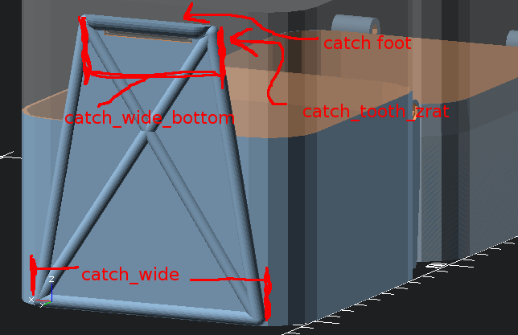

### catch_wide_bottom

How wide the bottom of the clasp should be. Values less than 1 are
factored against `catch_wide`, values greater than 1 are used
unmodified.

### catch_tooth_xrat

Factor of `catch_wide_bottom` defining the width of the catch tooth,
and the cutout in the catch body into which the tooth fits. Too wide
will leave the catch parts too delicate to use.

### catch_tooth_zrat

Factor defining the height at which the catch tooth sits. 0 is the
bottom of the box, 1 is the bottom of the lip (if `lip_rat` is
nonzero), experimentation may be required to tune this parameter
properly for any particular use case. 

### catch_thick

Maximum thickness of the catch clasp body, and the thickness of the
catch tooth. Defaults to `wall_thick *2` but that will only be
satisfactory for thin walled boxes. Our experiments suggest values
between 1.4 and 3.0 as a good window, much thinner is delicate and
much thicker is hard to operate as it doesn't flex enough. You will
have to be guided by your own results with your equipment.


### catch_inner_thick

Thickness of the inner filling of the catch clasp body. Can be 0 to
remove the reinforcing web entirely, which produced counter-intuitive
results in our testing.

### catch_fn

`$fn` parameter of the hulled hemispheres which make up the catch
body, and the catch tooth. 

### catch_hole_xtra

Extra allowance to remove from the hole around the catch
tooth. defaults to `CLEAR`.

### catch_offset

Goal space between the catch tooth and the catch clasp when the box is
assembled and closed. defaults to `CLEAR/2`.


### catch_foot_thick

Thickness of the catch foot peice, defaults to `catch_thick*2`. Can be
0 to disable the catch foot.

### catch_foot_xrat

Factor of `catch_wide_bottom`, width of the catch foot peice.

### catch_tooth_shape()
```
module catch_tooth_shape( cd, ch, cfn ) { capsule_qtr( cd, ch, cfn ); }
```

Define your own catch tooth shape here if you'd like.


-----------------------------------------------------
## Magwarts

Magwarts are a small rounded protrusion attached to both the box top
and bottom. These are hollowed out to contain magnets, which meet when
the assembled box is closed and provide retention through magnetic
attraction (assuming we've lined the magnets up properly).

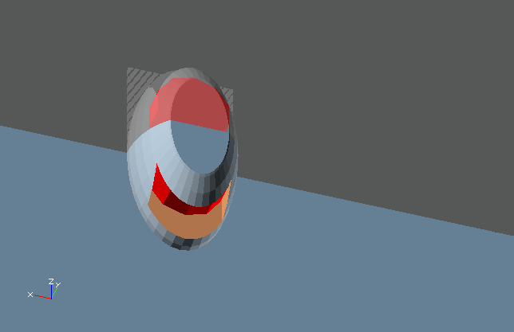

We've used 6mm x 2mm rare earth magnets with great success. The usual
cautions about these magnets should be observed; glue them firmly into
your final assembly and handle them with care to ensure children and
other small animals do not inadvertenly consume them.

=======================
```
magwart_points = [];

// as with hinge_zrat; the point at which the magwarts meet in the assembled box
magwart_zrat = 0.5;

// rotation angle for magnet slot. 0 = straight "down", -45 to +45 are likely useful angles.
magwart_slotra = 0;

// how far apart the magnets ride when closed. can be <0 to have the magnets peek out the flats
magwart_offset=false; // 0-CLEAR;

// diameter and height of magnet void (should be 0.3 to 0.6 or so larger than your magnets)
magnet_d =6.3; magnet_h =2.3;

// width of stress relief slot in magwart, 0 to disable
magnet_slot_d = 0.5;

// calculated later, default 
// [round( (magnet_d*1.0)+(wall_thick*2) ), 
//   round( (magnet_d*1.0)+(wall_thick*2) ), 
//   round( magnet_h+(wall_thick*2))]
magwart_box = false;
```

### magwart_points

Points to place magwarts. As with hinges and catch claps, these
specify the centerline of the part, as a factor applied to
`box_def.x`.


### magwart_zrat

Factor applied to `box_def.z`determining height at whigh the magwart
surfaces meet in the assembled, closed box. Like `hinge_zrat`. Should
probably be close to the top/bottom midpoint, or you'll have to
stretch the shape to fit.

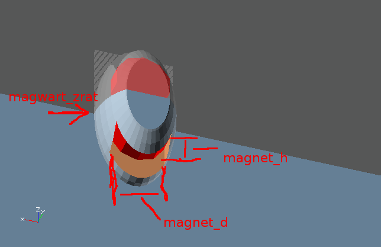


### magwart_box

[X,Y,Z] dimensions of the magwart. By default this is calculated from
supplied `magnet_d` and `magnet_h` as shown, by adding `wall_thick *
2` to the magnet size, and rounding that off. The 1.0 values in the
formula above provide an easy place to scale the X or Y and squash the
magwarts into different shapes should you wish.

On boxes with shorter tops, you may need to stretch your magwarts so
they reach. The default formula for calculating the size of the
magwart containing box is essentially "as small as possible" which is
rarely what's needed.

This box has `lip_rat = 0; top_rat = 0.1;`, and `magwart_zrat = 0.8;`.

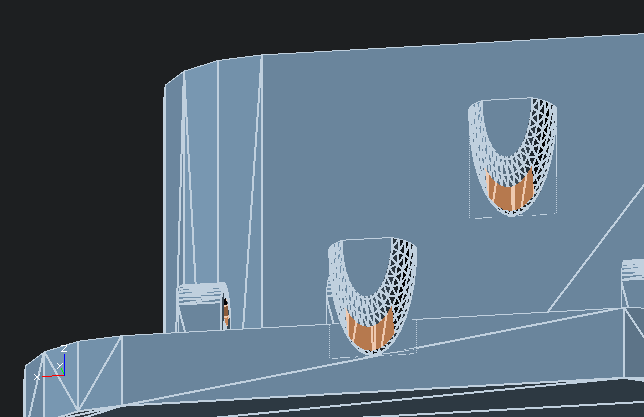

By distoring the box containing the magwart we extend it far enough to
attach to the box lid even though the magnets' meeting point is
further down the box bottom.

```
magwart_box= [
    round( (magnet_d*2.0)+(wall_thick*2) ), 
    round( (magnet_d*1.5)+(wall_thick*2) ), 
    round( magnet_h+(wall_thick*2))];
```

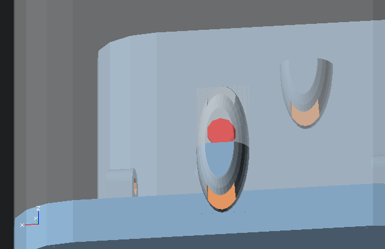


### magnet_d, magnet_h

The diameter and height, respectively, of the void and channel cut for
magnets. No clearance is added to this number in the code, make your
own allowance for your own parts. We're using 6mm x 2mm magnets and
the default values of 6.3mm x 2.3mm allow them to fit snugly without
quite being impossible to insert.


### magwart_offset

Factor added between the meeting point of the top and bottom magwarts,
when the box is assembled and closed. The default vaule of `0 - CLEAR`
leaves the tips of our 6mm magnets peeking through the surface of the
magwarts and makes for a good solid contact when the boxes close. 

### magnet_slot_d

If nonzero, specifies the width of a channel to cut through the center
of the magwart to the depth of the magnet. This can allow for stress
relief and easier magnet insertion, and may aid retrieval of magnets
if made larger. Other uses may be possible.

### magwart_slotra

Rotation angle of the slot in the magwart. the default 0 is straight
up/down (depending on if it's the top or bottom of the box); values of
-45 to +45 may be useful if there's need to insert magnets from a
different direction.

### magwart_shape()
```
module magwart_shape(d) { qwart(d); }
```

The default shape of the magwarts can be overridden by defining your own
`magwart_shape` module. For example, `module magwart_shape(d) {
cube(d); }` produces cubical magnet pockets:

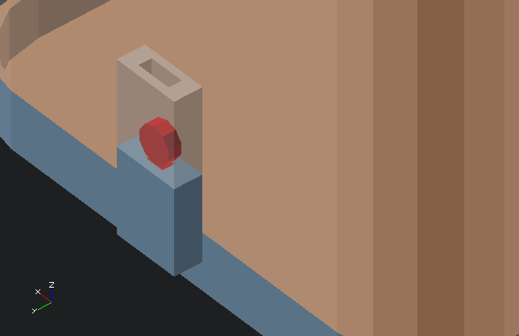

The parameter `d` in this case will be the same `magwart_box` you've
defined. See the documentation for [Callbacks](#callbacks) for more
discussion about overriding modules.


-----------------------------------------------------
## Screw Towers

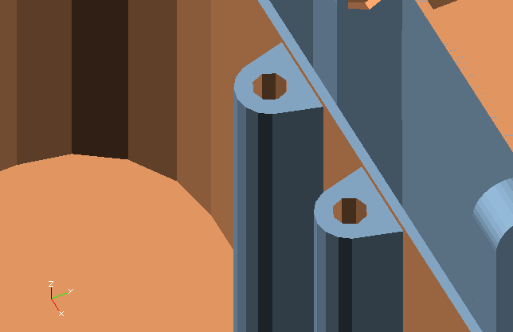

Screw towers are a reinforced cylindrical shape inside the box, meant
to hold a screw or ziptie for more permanent or secure closure. 

=======================
```
// points to place screw towers
screw_points = [];

// boolean, do screwtower in the top or bottom half of the box
screwtower_top = true;
screwtower_bottom = true;

// diameters of screw tower
screw_od = 8; screw_id = 3.3;

// factor to multiply screw_od by to brace to wall.
screw_bspread = 1.3;

// how deep the screw hole is (0 for none)
screw_deep = 16;

// $fn for screw tower outside and inside
screw_ofn = 16; screw_ifn = 8;

// reduce the size of the bottom of the screw hole a bit
screw_id_bottom = false; //(screw_id*0.80);

// (bool) have the screw hole go completely through the tower and bottom surface
screw_punchbottom = false;

// height of slot in screw tower (0 to disable feature)
screw_slot_h = 0;

// diameter of slot in screw tower
screw_slot_d = 0;

// extra factor to add to separate slots further or make them closer
// (positive values drive the slots further from each other,
// negative values bring them closer together
screw_slot_xdepth = 0;//(0-CLEAR);
```


### screw_points

Points at which to place screw towers. List of factors applied to
`box_def.x`

### screw_od

The diameter of the outer body of the screwtower.


### screw_bspread

Factor applied to `screw_od`, size of wall brace portion of
screwtower. set near 0 for a more cylindrical tower.

### screw_id

Diameter of the inner hole of screwtowers.

### screw_deep, screw_id_bottom

Depth of screw hole in bottom screwtower, if `screw_punchbottom` is
false. A taper can be applied to the hole with `screw_id_bottom` which
defaults to `screw_id * 0.8`.

### screw_punchbottom

Boolean, if true the bottom screwtower's inner hole will be extended
through the bottom of the box, as the top hole is; and the `hnut_t`
cutout removed from the bottom surface as specified. Also, if true, no
taper will be taken, as the hole is re-reamed.

### screw_ofn, screw_ifn

`$fn` of the outer and inner cylinder shapes comprising the screwtower.

### screwtower_top, screwtower_bottom

Boolean, default true. Set to false to remove the top or bottom
portion of the screwtowers should you wish to do that.

### screw_slot_h, screw_slot_d, screw_slot_xdepth

failed try at magnetic closure, left incase they turn out useful
somewhere. Could be used to hold nuts for internal hardware.


-----------------------------------------------------
## Callbacks
=======================

A "callback" is a do-nothing module, which provides a place for you to
define your own module that does *something* instead. We've defined
the following callback modules:

```
module insert_top( d ) {}
module insert_bottom( d) {}

module decorate_top( d ) {}
module decorate_bottom( d ) {}

module decorate_left( d ) {}
module decorate_right( d ) {}
module decorate_front( d ) {}
module decorate_back( d ) {}

module decorate_top_left( d ) {}
module decorate_top_right( d ) {}
module decorate_top_front( d ) {}
module decorate_top_back( d ) {}

module cutout_top( d ) {}
module cutout_bottom( d ) {}

module cutout_left( d ) {}
module cutout_right( d ) {}
module cutout_front( d ) {}
module cutout_back( d ) {}

module cutout_top_left( d ) {}
module cutout_top_right( d ) {}
module cutout_top_front( d ) {}
module cutout_top_back( d ) {}
```
=======================

These modules are invoked with the appropriate rotations and
translations applied for the face they apply to; and given as a
parameter a box definition `d` defining that face and wall
thickness.

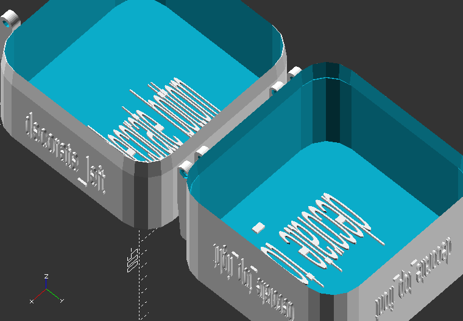
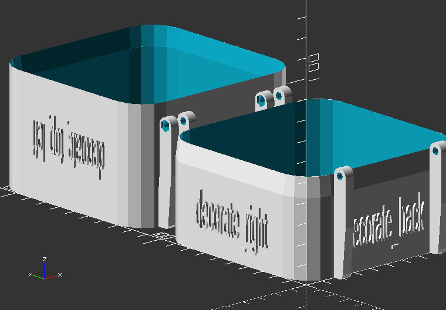


Any OpenSCAD code can be applied to any face easily. To make use of
this feature in your script, define a module named `decorate_top` (or
whichever name you need, read on) which accepts a parameter `d`, as
shown above. This module will then be called by the box script and
included at the right time.

For example, placing a text label on the inside top of the box:
```
module decorate_top( d ) { #linear_extrude() { text("Snafu" ); } }
```
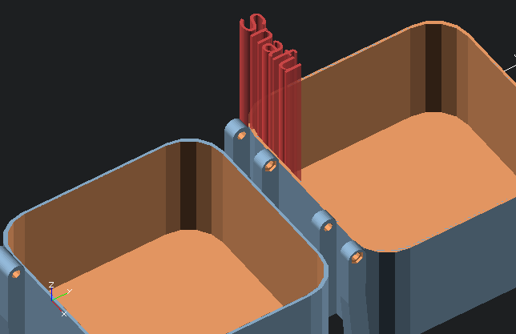

Utility functions are provided for performing several of the things we
wanted done. The code above puts that text at the corner of the face,
and probably isn't the desired size. We have provided a [utility function](#utilities)
to [scale and center](#center_scale) objects:

```
module decorate_top( d ) { center_scale( d, 0.42 ) { linear_extrude() { text("Snafu" ); } } }
```
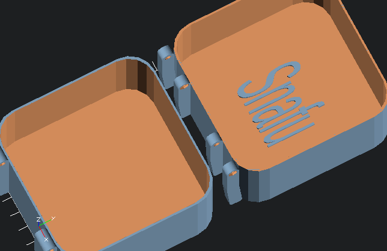


`insert_bottom` and `insert_top` are hooks to place structure inside
the top and bottom of the box. The provided [`diecut()`](#diecut) and
[`dividers()`](#dividers) utility modules allow for quick creation of
internal dividers. Our example boxes may include more complicated, custom
inserts.

`insert_` modules are given a definition that includes the full volume
of their box half. If you need to have structure projecting past the
division point of the box top and bottom, using the provided `d.z`
won't be sufficient.


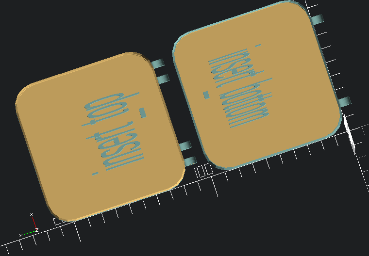
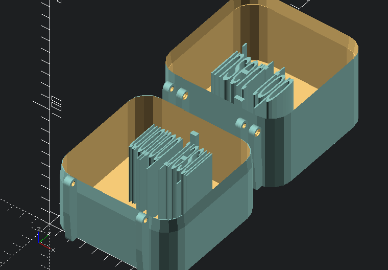


The bottom faces of the box are named `front`, `back`, `right` and
`left`; where the hinges are on the back of the box, and the clasps on
the front. The top faces are named `top_front`, `top_back`,
`top_right` and `top_left`. As the box is laid out in preview these
faces are rotated, but on assembly everything lines up correctly.


There are also callbacks for `top` and `bottom` which apply to the
**inside** faces of the whole inside area of the box top and
bottom. Placing protruding decorations under the 0 Z level can
certainly work but is likely to require more detailed effort and slicer
support than we wish to detail here. Cutouts on those faces backed by
walls for strength can give good results without requiring extra
effort.

`cutout_` modules are translated to *inside* the wall, `decorate_*`
modules are translated to just outside (or above) their wall. Both are
given a definition of X and Y of the sides of the face, and Z of
`wall_thick`. The area possibly lost as a result of `corner_radius` is
not accounted for in the code.


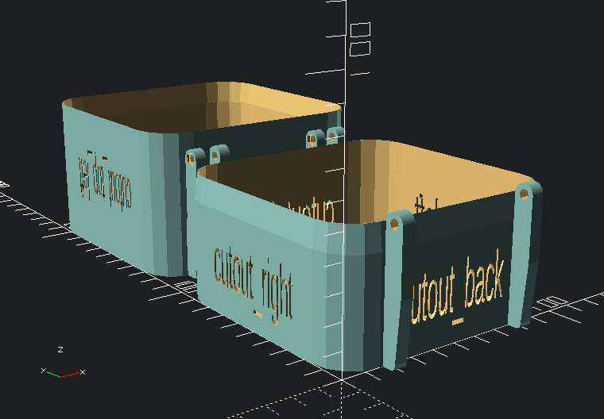
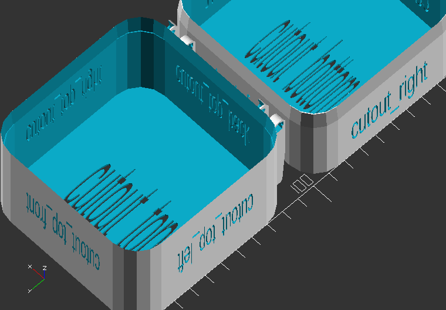


No provision is made to keep decorations and cutouts and
inserts from colliding or interfering with each other.

-----------------------------------------------------
## Parts

These are shapes to attach to boxes.


### Dovetails

We've provided a pair of interlocking dovetail shapes for making
groups of boxes that join together, or whatever other use such might
be put to. The dovetail rail part slides into the block, and depending
on the tolerances and clearances provided the resultant joint can be
tight enough to require significant force to open or can be simple
to slide apart.

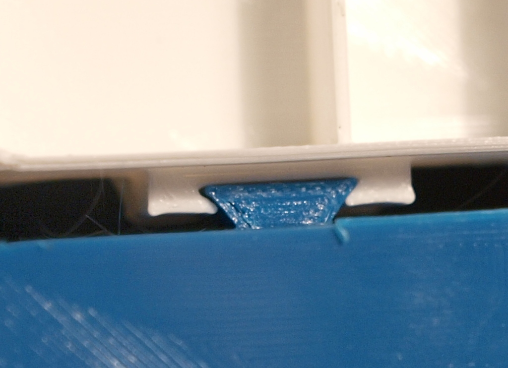

The specification of the dovetail shape applies only to that shape,
these variables do not affect the other box features, but the
same definition should be shared between the block and rail calls.

### dtspec

Vector of 5 numbers, which describe the dovetail shape.
```
dtspec = [height, top_wide, bottom_wide, taper=0, breakpt=0]
```

Where `height` is the heigth of the dovetail shape, `top_wide` is the
widest width, `bottom_wide` is the shorter width, at the bottom.
taper (if nonzero) is subtracted from the `top_width` of one end of
the dovetail tounge or positive shape, smoothly over the entire peice,
or if breakpt is nonzero, from breakpt to the end.

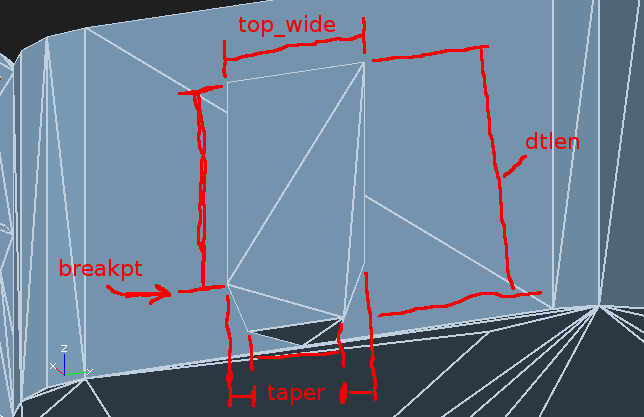


### dovetail_rail()
=======================
```
module dovetail_rail( tlen, dtspec )

    tlen - block length
    dtspec = [height, top_wide, bottom_wide, taper=0, breakpt=0]
              dovetail profile
    tpr - (=0) taper subtracted from one end. make negative to reverse
    tbk - (=0) point along length to begin tapering off
```
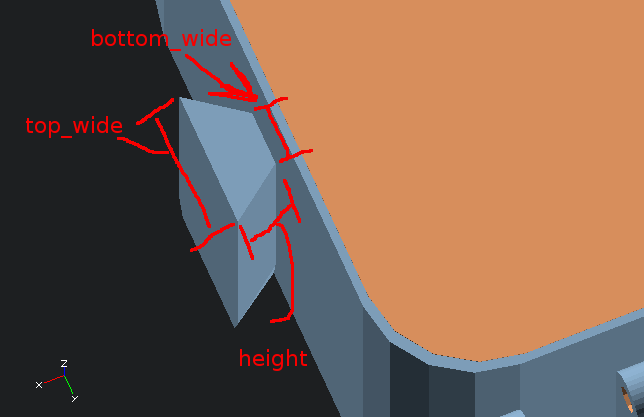

Dovetail rail of `dtspec` profile and `tlen` length.


### dovetail_block()
=======================
```
module dovetail_block( d, dtspec, clr=CLEAR )

    d - block desc (outside of notch)
    dtspec - dovetail profile, see dovetail_rail()

    note: no taper is taken from the notch shape
```
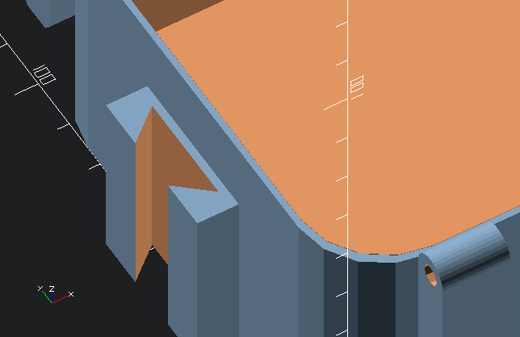

Block of dimensions specified by [X,Y,Z] vector `d`, with a dovetail
void removed from the center. `clr` is added to the dimensions of the
void, that is, removed from the block... Increase the value of `clr`
to make the final joint more loose, decrease `clr` to make the joint
tighter.

Our default `CLEAR` of 0.6mm results in dovetail joints that
are some effort to join and take apart, but survive repeated cycles of
assembly and disassembly well. Your circumstances may require
adjusting this factor.


### wartclip()
=======================
```
module wartclip( bd, thick, ra=0 ) {

    bd - bounding box
    thick - how thick the clip part is (at the top of the bounding box)
    ra - rotation angle to apply to clip body. 0 is parallel, ~ 10 will have the tip touching base level

```

Based on the same distorted quarter shphere as the magwarts, this
shape can be used as a belt clip, or loop. `thick` controls the top
leg that connects to the box, as well as the thickness of the clip
body. We've found 5mm strong enough to use and not too thick.

the rotation angle `ra` can be used to turn the tip of the clip
inwards towards the box body; perhaps providing a titghter grip on the
belt. It might be harder to print depending on your slicer.

To make a belt loop with this, place two, one rotated 180 degress from
the other.


-----------------------------------------------------
## Utilities

We've provided some utility modules to make it easier to do the things
we needed done and things we imagined others might need.

Several of these routines share the paramaters `d` to define the box; and
`scl` as a scaling factor. The scaling factor is applied to the X and
Y dimensions of the box `d` leaving Z alone.

### diecut()
=======================
```
module diecut(d) {}

- trims child objects to the base_box shape described by <d>

    d - [x,y,z] box definition
```

This provides for neatly cutting internal inserts so they don't poke
out of corners when using a larger `corner_radius` Could also be used
for rounding corners for decorative surfaces. Uses existing
`corner_radius` etc.

If this routine is cutting your objects too short, adjust `d.z`

Without `diecut()` | With `diecut()`
------------------|------------
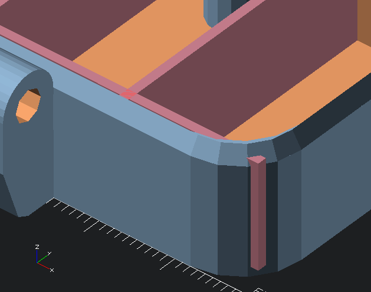 | 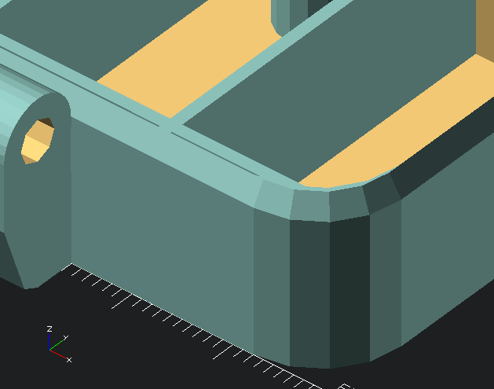


### center_scale()
=======================
```
module center_scale( d, scl ) {}

- X/Y centers and scales children in box <d>. NOTE uses resize() so may be slow.

    d - [x,y,z] box definition
    scl - factor by which to multiply d for scaling.
```

Too handy not to have. resizes and relocates children to fit in `scl`
of box `d`. No worries about what size the clipart you want on the box
top is; but probably lots of effort to get it to scale without
distortion. If that's your need look at the **auto** flag on the
OpenSCAD [`resize` function](https://en.wikibooks.org/wiki/OpenSCAD_User_Manual/Transformations#resize).

Without `center_scale()` | With `center_scale()`
------------------|------------
 | 


### slots(), yslots(), and grid()
=======================
```
module slots(d, scl, hsz, t=wall_thick ) 
module yslots(d, scl, hsz, t=wall_thick )
module grid(d, scl, hsz, t=wall_thick )

        d, scl - as above
        hsz - size of hole (gap between walls)
        t - thickness of wall (default wall_thick)
```

Routines to to make grids on 1 or both dimensions, constrained to
center/scaled portion of box <d>. Note that's constrained by uneven
division; not scaling. Asymmetrical results can be expected from
these.

Given: `d = [100,100,10]; scl = 0.75;`

Call |  Results
-------|---------
 `slots(d, scl, 9 );`  | 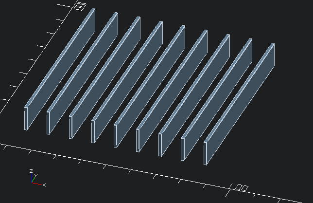
 `yslots(d, scl, 9 );`  | 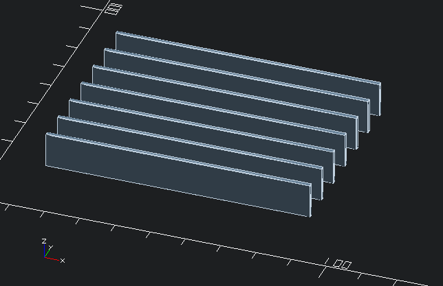
 `grid(d, scl, 9 );`  | 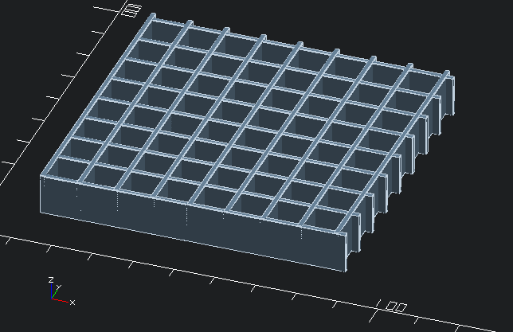


### cyl_grid()
=======================
```
module cyl_grid( d, scl, sz, iv, xfn=$fn )

- create a grid of cylinders (holes), center/scaled to box <d>

    d - [x,y,z] box definition
    scl - factor to scale by; how much space in <d> to fill 
    sz - size (diameter) of cylinder
    iv - interval, space between cylinders
    xfn - cylinder $fn
```
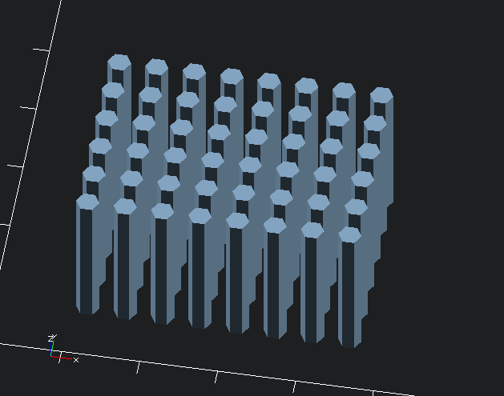

This also scales by rough division and will not completely fill the
scaled area where that does not evenly divide by the specified size
`sz` and interval `iv` parameters. The idea is for quick
perforations, thus:

```
module cutout(d) { cyl_grid(d, 0.60, 3, 4.8, 6 ); } 
//  Apply our cutout() module to each face we want perforated
module cutout_top( d ) { cutout(d); }
module cutout_bottom( d ) { cutout(d); }
module cutout_left( d ) { cutout(d); }
module cutout_right( d ) { cutout(d); }
```

This creates a grid of 6 facet cylinders, 3mm diameter, 4.8mm spacing,
over about 60% of the area of box `d`, and incises from the 4 faces of
the box.

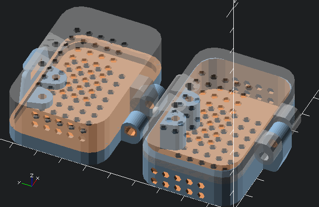


### dividers()
=======================
```
module dividers( d, xdiv, ydiv, h, t=wall_thick )

- create divider walls as defined by xdiv and ydiv lists

    d - 3vec [x,y,z] box definition
    xdiv - points along d.x to make dividers <h> high and <t> thick
    ydiv - same for d.y  (either list may be empty.)
    h - height of wall
    t - thickness of wall (defaults to wall_thick)
```

For use with `insert_top` and `insert_bottom` (possiibly useful
elsewhere); creates walls along either X or Y axes at defined
points.

The points specified in `xdiv` and `ydiv` are, if lewss that one (1),
taken as factors to apply to that dimension. Values greater than one
are used as absolute units for positioning.


To create a cross shape that divides a box into 4 sections:

```
module insert_bottom( d ) {
    diecut(d) {
        dividers(d, [0.5], [0.5], d.z);
    }
}
```
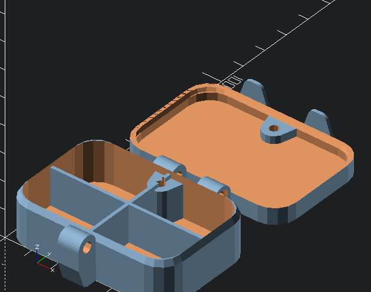

If you'd like two dividers along one dimension, instead:

```
module insert_bottom( d ) {
    diecut(d) {
        dividers(d, [0.25, 0.75], [0.5], d.z);
    }
}
```
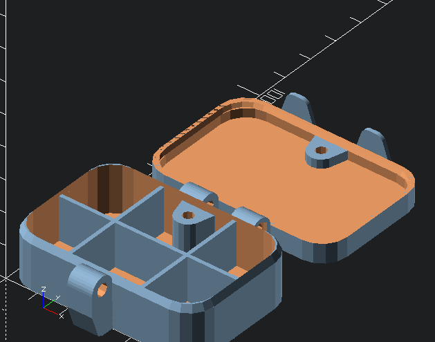

If you'd like the division in one dimension to be shorter, you could
call the module twice:

```
module insert_bottom( d ) {
    diecut(d) {
        dividers(d, [], [0.5], d.z / 2 );
        dividers(d, [0.25, 0.75], [], d.z);
    }
}
```


### cylinder_half(), capsule(), capsule_qtr()
=======================
```
module cylinder_half( cd, ch, cfn=$fn ) 
module capsule( cd, ch, cfn=$fn ) 
module capsule_qtr( cd, ch, cfn=$fn )

- Sortof cylinderish shapes useful for multiple purposes.

    cd - cylinder diameter
    ch - cylinder height
    cfn=$fn - cylinder $fn

```

`capsule_qtr()` is the default catch clasp tooth; and the other shapes
are documented as they may be handy for other uses too.

Call | Result
------|-------
`cylinder_half( 10, 20 );` | 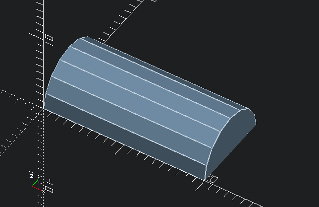
`capsule( 10, 20 );` | 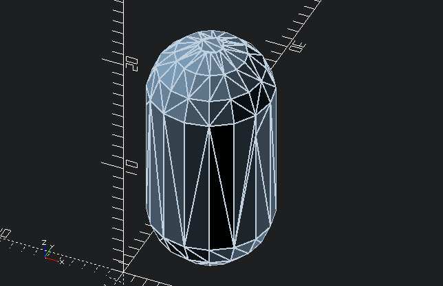
`capsule_qtr( 10, 20 );` | 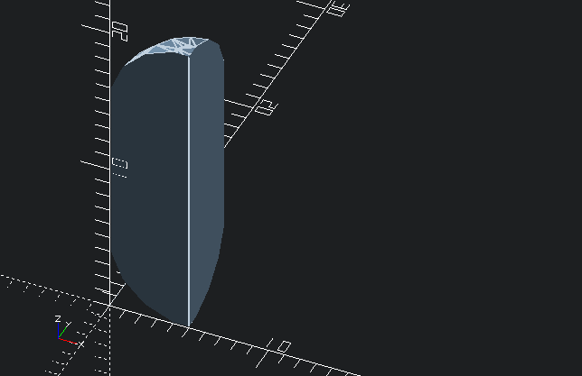


-------------------------------
   Copyright (c) 2019 Mark and Marie Lamb. Distributed under GPLv3, see LICENSE file for terms.

We hope you find this code useful, and ask that you **[hit this donate
link](https://www.paypal.com/cgi-bin/webscr?cmd=_s-xclick&hosted_button_id=J3AY8SM43A2DA&source=url)**
please.
