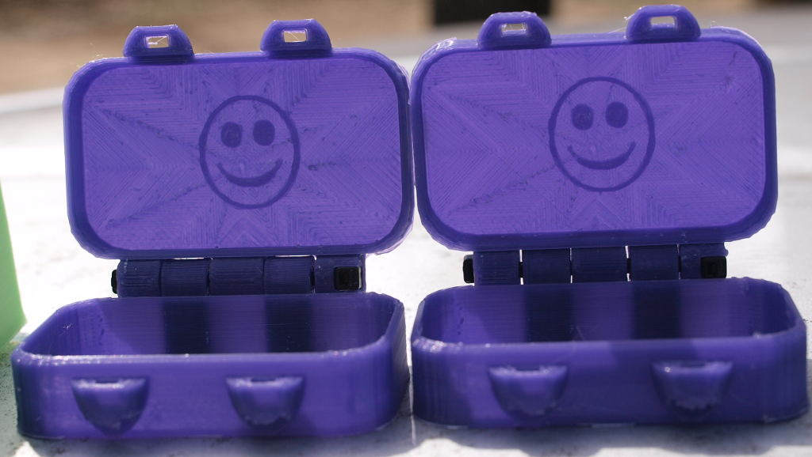
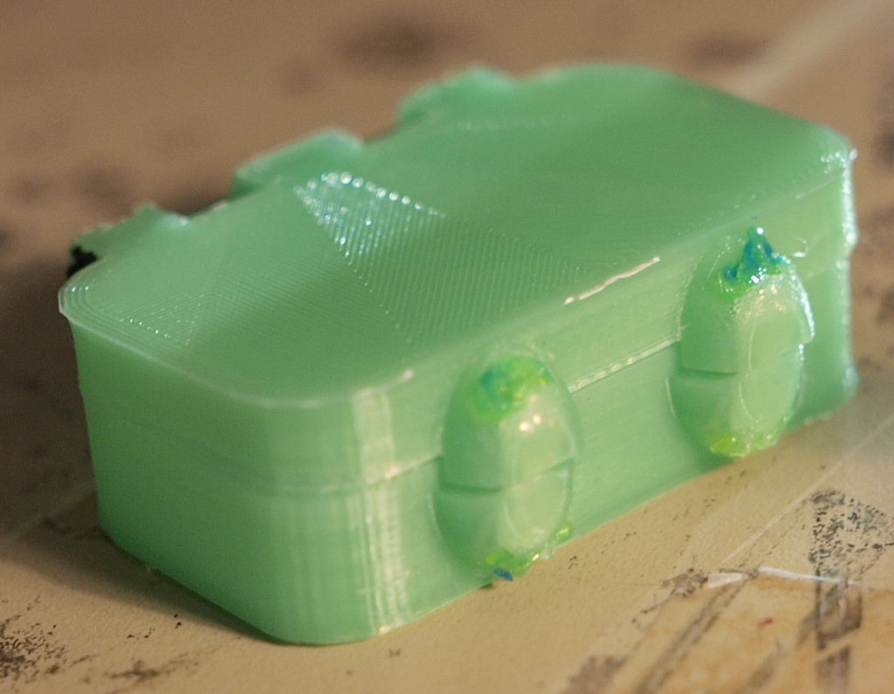
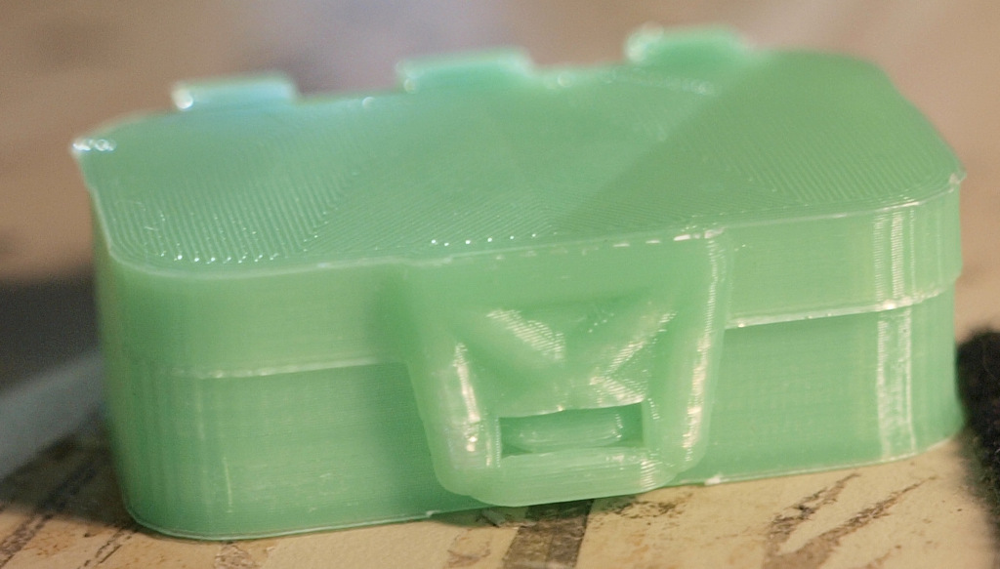

# Mark's Enclosure Helper - Mini Mint Tin
## with Magnetic or Catch Clasp


The famous mints used to (still may for all we know) have in "mini"
size, about 60mm x 35mm x 15mm, that was handy for all sorts of
things. We chose that size to devolp this generalized box code
against, as it's small enough to print in an hour and all the
prototypes can be given out to schoolchildren who will find them
charming regardless of their flaws.



This code comes set up for a pair of magent holders for 6mm x 2mm round
rare earth magnets. We found those cheap in bulk online use them for
many things; if you find a different size you can adjust `magnet_d`
and `magnet_h` to fit what you have. You may also wish to adjust those
numbers to make the magnets harder or easier to insert.



The `magwart_box` calculation determines the outer dimensions of the
wart that carries the magnet, see the [magwarts
reference](../REFERENCE.md#magwarts) for full documentation. For
immediate use you can change the sqish by playing with the `1.0` and
`1.6` values, which are distoriting the X and Y dimensions of the
magwart.



To use a catch clasp, comment out the `magwart_points` variable, and
uncomment the `catch_points` definition. In other words, make the file
look like this:
```
catch_points=[0.5];


//magwart_points = [0.3,0.7];

```

For further control of the clasp see the [catch clasp
reference](../REFERENCE.md#catch-clasps).


## Printing

We have printed these with 0.4mm, 0.5mm, and 0.6mm nozzles, in several
varietes of PLA, with and without supports and with and without print
cooling fans. Supports and fans can make details sharper but are not
striclty necessary.

At this wall thickness slicer settings having to do with perimiters
control more than infill. Our slicers have consistiently made the
hinge legs solid; they should function pretty well with lighter infill
as long as the perimiter is still firm enough to keep the shape.


-------------------------------
   Copyright (c) 2019 Mark and Marie Lamb. Distributed under GPLv3, see LICENSE file for terms.

We hope you find this code useful, and ask that you **[hit this donate
link](https://www.paypal.com/cgi-bin/webscr?cmd=_s-xclick&hosted_button_id=J3AY8SM43A2DA&source=url)**
please.
