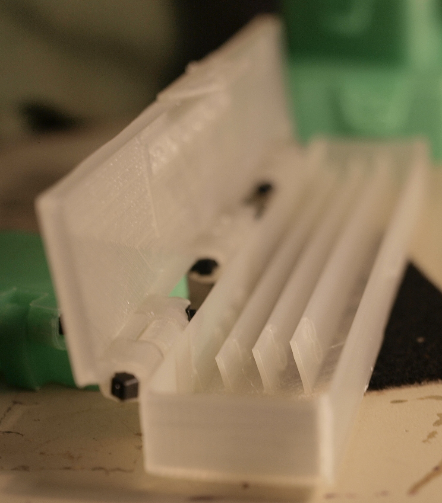

# Mark's Enclosure Helper - Needle Keeper with Sizing Guage

Marie's second foray into more complicated OpenSCAD code is a box for
sorting and storing douple pointed knitting neeldes.

The insert is a bit of custom (read hacked) code to make freestanding
ribs at a declining angle. This and the needle guage can both be done
more elegantly, but this serves the purpose and makes a functional
shape.

The sizing guage has text labels on the holes; which aren't visible
with the transparent PLA we printed the first example in. The holes
themselves required some post-print cleanout.

-------------------------------
   Copyright (c) 2019 Mark and Marie Lamb. Distributed under GPLv3, see LICENSE file for terms.

We hope you find this code useful, and ask that you **[hit this donate
link](https://www.paypal.com/cgi-bin/webscr?cmd=_s-xclick&hosted_button_id=J3AY8SM43A2DA&source=url)**
please.
