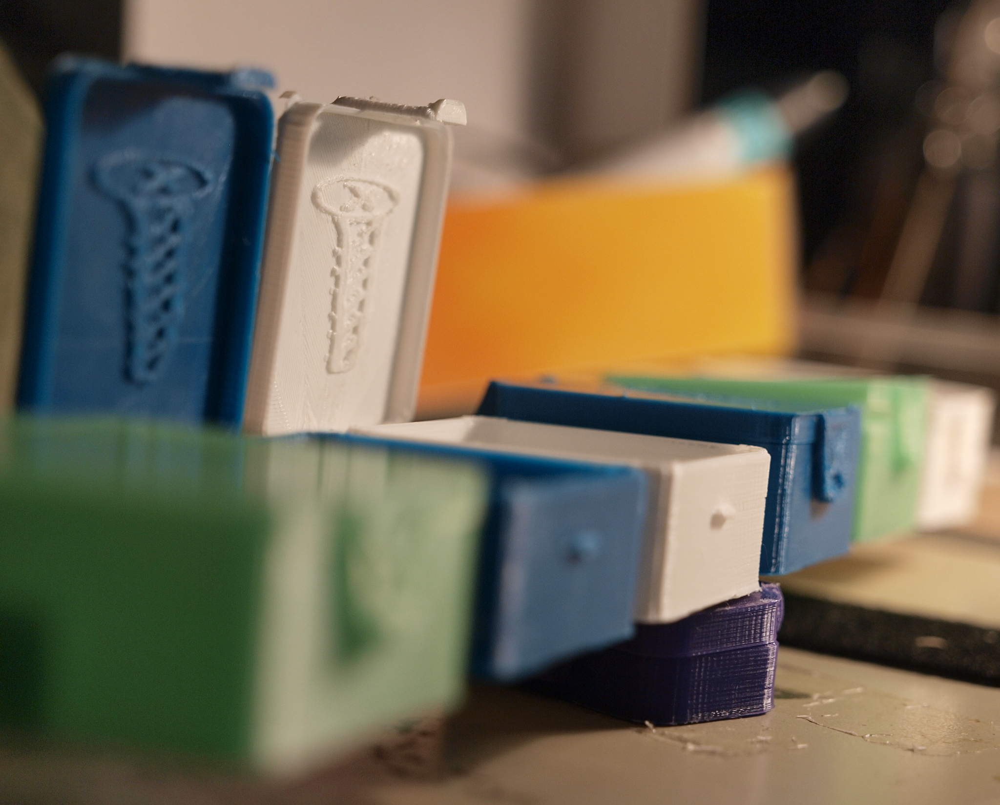

# Mark's Enclosure Helper - Interlocking Parts Box

Having purchased 10 M6 and 10 M10 screws with some effort and and
untenable expense, we're reluctant to chuck them into the
"Misc. Screws" bin and have to dig for them when we need one sometime
later. Therefor these small boxes to hold small quantities of things,
in a semi-organized and orderly way.

These boxes use dovetails to interlock, those are defined in the code
with `dtspec` and associated variables. See the [dovetails
reference](#../REFERENCE.md#dovetails) for details.

These are 4mm x 14mm in the dovetail portion, with a bit of a taper at
the bottom to make sliding them together easier. If you print with a
brim (which we always do) you may wish to pay attention to how you
trim around the dovetail; leaving the bottom of the block side filled
in can be a handy "floor".

We have printed these with 0.4mm, 0.5mm, and 0.6mm nozzles in several
different types of PLA and had them all interlock and work together
well. Supports and print cooling are both beneficial but not truly
necessary.

If you need to increase the space between the dovetail parts to make
them easier to slide together, increase the `dt_CLEAR` variable in the
`example-partbox.scad` file. Try steps of 0.2mm to your nozzle width
to begin with.

-------------------------------
   Copyright (c) 2019 Mark and Marie Lamb. Distributed under GPLv3, see LICENSE file for terms.

We hope you find this code useful, and ask that you **[hit this donate
link](https://www.paypal.com/cgi-bin/webscr?cmd=_s-xclick&hosted_button_id=J3AY8SM43A2DA&source=url)**
please.
